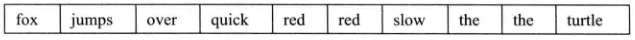

# 泛型算法
**顺序容器只定义了很少的操作，在多数的情况下，我们可以添加和删除元素、访问首尾元素、确定容器是否为空等。对于查找特定元素、替换或删除一个特定值、重排元素顺序等，标准库并未给每个容器都定义成员函数来实现这些操作，而是定义了一组泛型算法（generic algorithm）:称他们为“算法”，是因为他们是现在一些经典算法的公共接口，如排序和搜索：称它们是“泛型的”，是因为它们可以用于不同类型的元素和多重容器类型（不仅包括标准库类型，如vector和list，还包括内置的数组类型），还能用于其它类型的序列。**
1. find函数
``` C++
int val = 42;  // 我们将要查找的值
// 如果在vec中找到想要的元素，则会犯结果指向它，否则返回结果为vec.cend()
auto result = find(vec.cbegin(), vec.cend(), val);
//报告结果
cout << "The value " << val
     << (result == vec.cend()
        ? " is not present" : " is present") << endl;

// 用find在一个string的list中查找一个给定值
string val = "a value";  // 我们要查找的值
// 此调用在list中查找string元素
auto result = find(lst.cbegin(), lst.cend(), val);

// 类似的， 我们可以利用find在数组中查找值
int ia[] = {27, 210, 12, 47, 109, 83};
int val = 83;
int *result = find(begin(ia), end(ia), val);

// 还可以在序列的子范围中查找
// 在从ia[1]开始，直至（但不包含）ia[4]的范围内查找元素
auto result = find(ia + 1, ia + 4, val);
```
2. 只读算法
* 算法智慧读取其输入范围内的元素，而从不改变元素。find就是这样一种算法，count函数也是如此。
* 另一个只读算法是accumulate，它定义在头文件numeric中。accumulate函数接受三个参数，前两个指出了需要求和的元素的范围，第三个参数是和的初值。假定vec是一个整数序列，则：
``` C++
// 对vec中的元素求和，和的初始值是0
int sum = accumulate(vec.begin(), vec.end(), 0);
```
* 由于string定义了+运算符，所以我们可以通过调用accumulate来将vector中所有string元素连接起来：
``` C++
string sum = accumulate(v.cbegin(), v.cend(), string(""));
// 将v中每个元素连接到一个string上，该string初始时为空串。

//注：将空串当作一个字符字面值传递给第三个参数是不可以的，会导致一个编译错误
// 错误：const char*上没有定义+运算符
string sum = accumulate(v.cbegin(), v.cend(), "");
// 如果我们传递了一个字符串字面值，用于保存和的对象的类型将是const char*。
```
* 对于只读取而不改变元素的算法，通常最好使用cbegin()和cend(); 如果计划使用算法返回的迭代器来改变元素的值，就需要使用begin()和end()的结果作为参数。

* equal算法

equal算法用于确定两个序列是否保存相同的值。它将第一个序列中的每个元素与第二个序列中的对应元素进行比较。如果所有元素都相等，则返回true，否则返回false。此算法接受三个迭代器：前两个表示第一个序列中的元素范围，第三个表示第二个序列的首元素：
``` C++
// roster2中的元素数目应该至少与roster1一样多
equal(roster1.cbegin(), roster1.cend(), roster2.cbegin());
```
3. 写容器元素的算法
* fill算法

fill接受一对迭代器表示一个范围，还接受一个值作为第三个参数。fill将给定的这个值赋予输入序列中的每个元素。
``` C++
fill(vec.begin(), vec.end(), 0);  // 将每个元素设置为0

// 将容器中的一个子序列设置为0
fill(vec.begin(), vec.begin() + vec.size() / 2, 10);
```
* fill_n函数

函数fill_n接受一个单迭代器、一个计数值和一个值。它将给定值赋予迭代器指向的元素开始的指定个元素。
``` C++
vector<int> vec;  // 空vector
// 使用vec，赋予它不同值
fill_n(vec.begin(), vec.size(), 0);  // 将所有元素重置为0

//不可以在空容器上调用fill_n
// 错误写法：
vector<int> vec;  // 空vector
fill_n(vec.begin(), 10, 0);
// 我们指定了要写入10个元素，但是vec中并没有元素——它是空的。
```
* back_inserter

back_inserter接受一个指向容器的引用，返回一个与该容器绑定的插入迭代器。当我们通过此迭代器赋值时，赋值运算会调用push_back将一个具有给定值的元素添加到容器中：
``` C++
vector<int> vec;  // 空向量
auto it = back_inserter(vec);  // 通过它赋值会将元素添加到vec中
*it = 42;

// 我们常常使用back_inserter来创建一个迭代器，作为算法的目的位置来使用。
vector<int> vec;  // 空向量
// back_inserter创建一个插入迭代器，可用来向vec添加元素
fill_n(back_inserter(vec), 10, 0);  // 添加10个元素到vec
```
在每步迭代中，fill_in向给定序列的一个元素赋值。由于我们传递的参数是back_inserter返回的迭代器，因此每次赋值都会在vec上调用push_back。最终，这条fill_in调用语句向vec的末尾添加了10个元素，每个元素的值都是0

4. 拷贝算法
* 拷贝算法是另一个向目的位置迭代器指向的输出序列中的元素写入数据的算法。此算法接受三个迭代器，前两个表示一个输入范围，第三个表示目的序列的起始位置。此算法将输入范围中的元素拷贝到目的序列中。传递给copy目的序列至少要包含与输入序列一样多的元素。
``` C++
int a1[] = {0, 1, 2, 3, 4, 5, 6, 7, 8, 9};
int a2[sizeof(a1) / sizeof(*a1)];  // a2与a1大小一样
// ret指向拷贝到a2的尾元素之后的位置
auto ret = copy(begin(a1), end(a1), a2);  // 把a1的内容拷贝给a2
```
* copy返回的是其目的位置迭代器（递增后）的值。即，ret恰好指向拷贝到a2的尾元素之后的值。

* 注：多个算法都提供所谓的“拷贝”版本。这些算法计算新元素的值，但是不会将他们放置在输入序列的末尾，而是创建一个新序列保存这些结果。
``` C++
// 将所有的值为0的元素改为42
replace(ilist.begin(), ilist.end(), 0, 42);
//此调用将序列中所有的0都替换为42。如果我们希望保留原序列不变，可以调用replace_copy。此算法接受额外第三个迭代器参数，指出调整后序列的保存位置。


// 使用back_inserter按需要增长目标序列
replace_copy(ilist.cbegin(), ilist.cend(), back_inserter(ivec), 0, 42);
// 此调用后，ilist并未改变，ivec包含ilist的一份拷贝，不过原来在ilist中值为0的元素在ivec中都变为42。
```
* 消除重复单词

为了消除重复单词，首先将vector排序，使得重复的单词都相邻出现。一旦vector排序完毕，我们就可以使用另一个称为unique的标准库算法来重排vector，使得不重复的元素出现在vector的开始部分。
``` C++
void eliDups(vector<string> &words) {
    // 按照字典排序words，以便查找重复单词
    sort(words.begin(), words.end());
    // unique重排输出范围，使得每个单词只出现一次
    // 排列在范围的前部，返回指向不重复区域之后一个位置的迭代器
    auto end_unoque = unique(words.begin(), words.end());
    // 使用向量操作erase删除重复单词
    words.erase(end_unique, words.end());
}
```
* sort算法接受两个迭代器，表示要排序的元素范围，我蛮排序整个vector。完成sort后，words的顺序如下所示：

* words排序完毕后，我们希望将每个单词都只保存一次。unique算法重新输入序列，将相邻的重复项“消除”，并返回一个指向不重复值范围末尾的迭代器。调用unique后，vector变为：

* words的大小并未改变，它仍然有10个元素。但是这些元素的顺序被改变了——相邻的重复元素被“删除”了。它只是覆盖相邻的重复元素，使得不重复元素出现在序列开始部分。unique返回的迭代器指向最后一个不重复元素之后的位置。

5. 定制操作
* 向算法传递函数
``` C++
// 比较函数，用来按长度排序单词
bool isShorter(const string &s1, const string &s2) {
    return s1.size() < s2.size();
}
//按长度由短至长排序words
sort(words.begin(), words.end(), isShorter);

elimDups(words); // 将words按字典重排，并消除重复单词
stable_sort(words.begin(), words.end(), isShorter);
for(const auto &s: words)  // 无须拷贝字符串
    cout << s << " ";  // 打印每个元素，以空格分隔
cout << endl;
```

6. lambda表达式
* 一个lambda表达式表示一个可调用的代码单元。可以将其理解为一个未命名的内联函数。与任何函数类似，一个lambda具有一个返回类型，一个参数列表和一个函数体。
* lambda可能定义在函数内部，一个lambda表达式具有如下形式
``` C++
[capture list] (parameter list) -> return type { function body }
// 其中，capture list（捕获列表）是一个lambda所在函数中定义的局部变量的列表（通常为空）：return type、parameter list和function body与任何普通函数一样，分别表示返回类型、参数列表和函数体。但是，与普通函数不同，lambda必须使用尾置返回（-> return type）来指定返回类型。

auto f = [] { return 42; }
cout << f() << endl;  // 打印42
// 我们定义了一个可调用对象f，它不接受参数，返回42
```
* 在lambda中忽略括号和参数列表等价于指定一个空参数列表。在此例中，当调用f时，参数列表是空的。如果忽略返回类型，lambda根据函数体中的代码推断出返回类型。如果函数体只是一个return语句，则返回类型从返回的表达式的类型推断而来，否则，返回类型为void。
* 调用一个lambda时给定的实参被用来初始化lambda的形参。通常，实参和形参的类型必须匹配。但与普通函数不同，lambda不能有默认参数。因此，一个lambda调用的实参数目永远与形参数目相等。

可以使用此lambda来调用stable_sort:
``` C++
//按照长度排序，长度相同的单词维持字典顺序
stable_sort(words.begin(), words.end(),
            [](const string &a, const string &b)
            { return a.size() < b.size();});
```
* 一个lambda通过将局部变量包含在其捕获列表中来指出将会使用这些变量。捕获列表指引lambda在其内部包含访问局部变量所需的信息。
* 值捕获

我们的lambda采用值捕获的方式。与传值参数类似，采用值捕获的前提是变量可以拷贝。与参数不同，被捕获的变量的值是在lambda创建时拷贝，而不是调用时拷贝：
``` C++
void fcn1() {
    size_t v1 = 42;  // 局部变量
    // 将v1拷贝到名为f的可调用对象
    auto f = [v1] { return v1; };
    v1 = 0;
    auto j = f();  // j为42；f保存了我们创建它时v1的拷贝
}
```

* 引用捕获

我们定义lambda时可以采用引用方式捕获变量。
``` C++
void fcn2() {
    size_t v1 = 42;  // 局部对象
    // 对象f2包含v1的引用
    auto f2 = [&v1] { return v1; };
    v1 = 0;
    auto j = f2();  // j为0；f2保存v1的引用，而非拷贝
}
```
* v1之前的&指出v1应该以引用方式捕获。一个引用方式捕获的变量与其它任何类型的引用的行为类似。当我们在lambda函数体内使用此变量时，实际上使用的是引用所绑定的对象。
* 如果我们采用引用方式捕获一个变量，就必须确保被引用的对象在lambda执行的时候是存在的。lambda捕获的都是局部变量，这些变量在函数结束后就不复存在了。如果lambda可能在函数结束后执行，捕获的引用指向的局部变量已经消失。
``` C++
// 我们希望biggies函数接受一个ostream的引用，用来输出数据，并接受一个字符作为分隔符
void biggies(vector<string> &words, vector<string>::size_type sz, 
            ostream &os = cout, char c = ' ')
{
    for_each(words.begin(), words.end(), 
            [&os, c](const string &s) { os << s << c; });
}
// 我们不能拷贝ostream对象，因此捕获os的唯一方法就是捕获其引用。
```
* for_each函数的用法(摘自cplusplus.com)
``` C++
// Applies function fn to each of the elements in the range [first,last).
template<class InputIterator, class Function>
  Function for_each(InputIterator first, InputIterator last, Function fn)
{
  while (first!=last) {
    fn (*first);
    ++first;
  }
  return fn;      // or, since C++11: return move(fn);
}
```
* 我们也可以从一个函数返回lambda。函数可以直接返回一个可调用对象，或者返回一个类对象，该类含有可调用对象的数据成员。
* 如果函数返回一个lambda，则与函数不能返回一个局部变量的引用类似，此lambda也不能包含引用捕获。
* 当以引用方式捕获一个变量时，必须保证在lambda执行时变量是存在的。

* 隐式捕获

除了显式列出我们希望使用的来自所在函数的变量之外，还可以让编译器根据lambda体中的代码来推断我们要使用哪些变量。为了指示编译器推断捕获列表，应在捕获列表中写一个&或者=。&告诉编译器采用捕获引用方式，=则表示采用值捕获方式。
``` C++
// sz为隐式捕获，值捕获方式
wc = find_if(words.begin(), words.end(), 
            [=](const string &s)
            { return s.size() >= sz; });
```
* 如果我们希望对一部分变量采用值捕获，对其它变量采用引用捕获，可以混合使用隐式捕获和显式捕获：
``` C++
void biggies(vector<string> &words,
            vector<string>::size_type sz,
            ostream &os = cout, char c = ' ')
{
    // os隐式捕获，引用捕获方式；c显示捕获，值捕获方式
    for_each(words.begin(), words.end(),
            [&, c](const string &s) { os << s << c; });
    // os显示捕获，引用捕获方式；c隐式捕获，值捕获方式
    for_each(words.begin(), words.end(),
        [=, &os] (const string &s)  { os << s << c; });
}
```
* 当我们混合使用隐式捕获和显示捕获时，捕获列表中的第一个元素必须是一个&或=。此符号指定了默认捕获方式为引用或值。
* 当混合使用隐式捕获和显示捕获时，显示捕获的变量必须使用与隐式捕获不同的方式。即，如果隐式捕获是引用方式（使用了&），则显示捕获明明变量必须采用值方式，因此不能在其名字前使用&，类似，如果隐式捕获采用的是值方式（使用了=），则显示捕获命名变量必须采用引用方式，即，在名字前使用&。


* 可变lambda
默认情况下，对于一个值被拷贝的变量，lambda不会改变其值。如果我们希望能改变一个被捕获的变量的值，就必须在参数列表首加上关键字mutable。
``` C++
void fcn3() {
    size_t v1 = 42;  // 局部变量
    // f可以改变它所捕获的变量的值
    auto f = [v1] () mutable { return ++v1; };
    v1 = 0;
    auto j = f();  // j为43
}
```
* 一个引用捕获的变量是否（如往常一样）可以修改依赖于此引用指向的是一个const类型还是一个非const类型
``` C++
void fcn4() {
    size_t v1 = 42;  // 局部变量
    // v1是一个非const变量的引用
    // 可以通过f2中的引用来改变它
    auto f2 = [&v1] { return ++v1; };
    v1 = 0;
    auto j = f2();  // j为1
}
```
* 指定lambda的返回类型

默认情况下，如果一个lambda体包含return之外的任何语句，则编译器假定此lambda返回void。与其它返回void的函数类似，被推断返回void的lambda不能返回值。
``` C++
transform(vi.begin(), vi.end(), vi.begin(), 
        [](int i) { return i < 0 ? -i : i; });
// 函数transform接受三个迭代器和一个可调用对象。前两个迭代器表示输入序列，第三个迭代器表示目的位置。算法对输入序列中每个元素调用可调用对象，并将结果写到目的位置。
// 目的位置迭代器与表示输入序列开始位置的迭代器可以是相同的。当输入迭代器和目的迭代器相同时，transform将输入序列中每个元素替换为可调用对象操作该元素得到的结果。
// 在本例中，我们传递给transform一个lambda，它返回其参数的绝对值。lambda体是单一的return语句，返回一个条件表达式的结果。无须指定其返回类型，因为可以根据条件运算符的类型推断出来。但是，如果换成等价的if语句，就会产生编译错误：
// 错误：不能推断lambda的返回类型
transform(vi.begin(), vi.end(), vi.begin(),
        [](int i) { if (i < 0) return -i; else return i; });
// 编译器推断这个版本的lambda返回类型为void，但是它返回了一个int值。
```
* 当我们需要为一个lambda定义返回类型时，必须使用尾置返回类型。
``` C++
transform(vi.begin(), vi.end(), vi.begin(),
        [](int i) -> int
        { if (i < 0)    return -i; else return i; });
```


