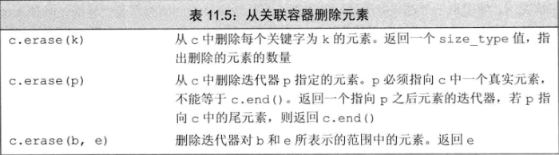

# 关联容器
1. 总述
**关联容器和顺序容器有着根本的不同：关联容器中的元素是按照关键字来保存和访问的。与之相对，顺序容器中的元素是按他们在容器中的位置来顺序保存和访问的。**
* 两个主要的关联容器类型是map和set。map中的元素是一些关键字-值(key-value)对：关键字起到索引的作用，值则表示与索引相关联的数据。
* 类型map和multimap定义在头文件map中；set和multiset定义在头文件set中；无序容器则定义在头文件unordered_map和unordered_set中。

* map是关键字-值对的集合。例如，可以将一个人的名字作为关键字，将其电话号码作为值。map类型通常被称为关联数组。关联数组与“正常”数组类似，不同之处在于其下标不必是整数。与之相对，set就是关键字的简单集合。当只是想知道一个值是否存在时，set是最有用的。
``` C++
// 使用map
map<string, size_t> word_count;  // string到size_t的空map
string word;
while (cin >> word) ++word_count[word];  // 提取word的计数器并将其加1
for(const auto &w : word_count)  // 对map中的每个元素
    // 打印结果
    cout << w.first << " occurs " << w.second
         << ((w.second > 1) ? " times": " time") << endl;

// 当从map中提取一个元素时，会得到一个pair类型的对象。
```

``` C++
// 使用set
// 统计输入中每个单词出现的次数
map<string, size_t> word_count;  // string带size_t的空map
set<string> exclude = {"The", "But", "And", "Or", "An", "A"};
string word;
while(cin >> word) {
    // 只统计不在exclude中的单词
    if (exclude.find(word) == exclude.end())
        ++word_count[word];  // 获取并递增word的计数器
}
// find调用返回一个迭代器。如果给定关键字再set中，迭代器指向该关键字。否则，find返回尾后迭代器。仅当word不在exclude中时我们才更新word的计数器
```
* 一个map或set中的关键字必须是唯一的，对于一个给定的关键字，它只能有一个元素的关键字等于它。容器multimap和multiset没有此限制，它们都允许多个元素具有相同的关键字。
``` C++
// 定义一个有20个元素的vector，保存0到9每个整数的两个拷贝
vector<int> ivec;
for(vector<int>::size_type i = 0; i != 10; i ++) {
    ivec.push_back(i);
    ivec.push_back(i);  // 每个元素重复保存一次
}
// iset包含来自ivec的不重复的元素；miset包含所有20个元素
set<int> iset(ivec.cbegin(), ivec.cend());
multiset<int> miset(ivec.cbegin(), ivec.cend());
cout << ivec.size() << endl;  // 打印出20
cout << iset.size() << endl;  // 打印出10
cout << miset.size()  << endl;  // 打印出20
```
2. 关键字类型要求
* 默认情况下，标准库使用关键字类型的<运算符来比较两个关键字。可以向一个算法提供我们自己定义的比较操作，与之类似，也可以提供自己定义的操作来替代关键字上的<运算符。所提供的操作必须在关键字类型上定义一个严格弱序。可以将严格弱序看作“小于等于”。
* 例如，我们不能直接定义一个Sales_data的multiset，因为Sales_data没有<运算符。但是，可以用compareIsbn函数来定义一个multiset。此函数在Sales_data对象的ISBN成员上定义了一个严格弱序。
``` C++
bool compareIsbn(const Sales_data &lhs, const Sales_data &rhs) {
    return lhs.isbn() < rhs.isbn();
}
```
* 为了使用自己定义的操作，在定义multiset时我们必须提供两个类型：关键字类型Sales_data，以及比较操作类型——应该是一种函数指针类型，可以指向compareIsbn。当定义此容器类型的对象时，需要提供想要使用的操作的指针。在本例中，我们提供一个指向compareIsbn的指针：
``` C++
// bookstore中的多条记录可以有相同的ISBN
// bookstore中的元素以ISBN的顺序进行排列
multiset<Sales_data, decltype(compareIsbn)*> bookstore(compareIsbn);
```
* 当用decltype来获得一个函数指针类型时，必须加上一个*来指出我们要使用一个给定函数类型的指针。
* 用compareIsbn来为这些元素添加对象，这表示当我们向bookstore添加元素时，通过调用compareIsbn来为这些元素排序。
* 可以用compareIsbn代替&compareIsbn作为构造函数的参数，因为当我们使用一个函数的名字时，在需要的情况下它会自动转化为一个指针。

3. pair类型

* pair类型定义在头文件utility中。
* 一个pair保存两个数据成员。类似容器，pair是一个用来生成特定类型的模板。当创建一个pair时，我们必须提供两个类型名，pair的数据成员将具有对应的类型。两个类型不要求一样。
``` C++
pair<string, string> anon;  // 保存两个string
pair<string, size_t> word_count;  // 保存一个string和一个size_t
pair<string, vector<int>> line;  // 保存string和vector<int>
```
* pair的默认构造函数对数据成员进行值初始化。因此anon是一个包含两个空string的pair，line保存一个空string和一个空vector。word_count中的size_t成员值为0，而string成员被初始化为空。
初始化：
``` C++
pair<string, string> author{"James", "Joyce"};
// 创建一个名为author的pair，两个成员被初始化为"James"和"Joyce",与其它标准库类型不同，pair的数据成员是public的，两个成员分别命名为first和second。我们用普通的成员访问符号来访问它们。
cout << w.first << " occurs " << w.second
     << (w.second > 1) ? : " times": " time" << endl;
```

* 创建pair对象的函数
``` C++
pair<string, int>
process(vector<string> &v) {
    // 处理v
    if (!v.empty()) return {v.back(), v.back().size()};  // 列表初始化
    else    return pair<string, int>();  // 隐式构造返回值
}
// 若v不为空，我们返回一个由v中最后一个string及其大小组成的pair。否则，隐式构造一个空pair，并返回它。
```
4. 关联容器的操作
* 关联容器定义了如下表中列出的类型。这些类型表示容器关键字和值的类型。


``` C++
set<string>::value_type v1;  // v1是一个string
set<string>::key_type v2;  // v2是一个string
map<string, int>::value_type v3;  // v3是一个pair<const string, int>
map<string, int>::key_type v4;  // v4是一个string
map<string, int>::mapped_type v5;  // v5是一个int
```
* 与顺序容器一样，我们使用作用域运算符来提取一个类型的成员——例如，map<string, int>::key_type.

6. 关联容器迭代器
* 当解引用一个关联容器迭代器时，我们会得到一个类型为容器的value_type的值得引用。对map而言，value_type是一个pair类型，其first成员保存const的关键字，second成员保存值。
``` C++
// 获得指向word_count中一个元素的迭代器
auto map_it = word_count.begin();
// *map_it是指向一个pair<const string, size_t>对象的引用
cout << map_it->first;  // 打印此元素的关键字
cout << " " << map_it->second;  // 打印此元素的值
map_it->first = "new key";  // 错误，关键字是const的
++map_it->second;  // 正确：我们可以通过迭代器改变元素
```

* 一个map的value_type是一个pair，我们可以改变pair的值，但不能改变关键字成员的值。
* 一个set中的关键字也是const的。可以用一个set迭代器来读取元素的值，但是不能修改：
``` C++
set<int> iset = {0, 1, 2, 3, 4, 5, 6, 7, 8, 9};
set<int>::iterator set_it = iset.begin();
if (set_it != iset.end()) {
    *set_it = 42;  // 错误：set中的关键字是只读的
    cout << *set_it << endl;  // 正确：可以读关键字
}
```
* 遍历关联容器
``` C++
// 获得一个指向元素的迭代器
auto map_it = word_count.cbegin();
// 比较当前迭代器和尾后迭代器
while (map_it != word_count.cend()) {
    // 解引用迭代器，打印键值对
    cout << map_it->first << " occurs "
         << map_it->second << " times" << endl;
    ++map_it;  // 递增迭代器，移动到下一个元素
}
```
* 添加元素
set添加元素
``` C++
vector<int> ivec = {2, 4, 6, 8, 2, 4, 6, 8};  // ivec有8个元素
set<int> set2;  // 空集合
set2.insert(ivec.cbegin(), ivec.cend());  // set2中有四个元素
set2.insert({1, 3, 5, 7, 1, 3, 5, 7});  // set2现在有8个元素
// insert有两个版本，分别接受一对迭代器，或者是一个初始化列表，这两个版本的行为类似对应的构造函数。
```
map添加元素
``` C++
// 对一个map进行insert操作时，必须记住元素类型是pair
// 向word_count插入word的4中方法
word_count.insert({word, 1});
word_count.insert(make_pair(word, 1));
word_count.insert(pair<string, size_t>(word, 1));
word_count.insert(map<string, size_t>::value_type(word, 1));
```

* insert的返回值依赖于容器类型和参数。**对于不包含重复关键字的容器，添加单一元素的insert和emplace版本返回一个pair，告诉我们插入操作是否成功。pair的first成员是一个迭代器，指向具有给定关键字的元素；second成员是一个bool值，指出元素是插入成功还是已经存在于容器中**。如果关键字已经在容器中，则insert什么事情也不做，且返回值中的bool部分为false。如果关键字不存在，元素被插入容器中，且bool值为true。
``` C++
// 统计每个单词在输入中出现次数的一种更繁琐的写法
map<string, size_t> word_count;  // 从string到size_t的空map
string word;
while (cin >> word) {
    // 插入一个元素，关键字等于word，值为1
    // 若word已在word_count中，insert什么也不做
    auto ret = word_count.insert({word, 1});
    if (!ret.second)  // word已在word_count中
        ++ret.first->second;  // 递增计数器
}
```
* 向multiset或者multimap添加元素
``` C++
multimap<string, string> authors;
// 插入第一个元素，关键字为Barth, John
authors.insert({"Barth, John", "Sot-Weed Factor"});
// 正确：添加第二个元素，关键字也是Barth, John
authors.insert({"Barth, John", "Lost in the Funhouse"});
```
* 对允许重复关键字的容器，接受单个元素的insert操作返回一个指向新元素的迭代器。这里无需返回一个bool值，因为insert总是向这类容器中加入一个新元素。

* 删除元素

共有三个版本的erase，我们可以通过传递给erase一个迭代器或一个迭代器对象来删除一个元素或者一个元素范围。这两个版本的erase与对应的顺序容器的操作非常相似：指定的元素被删除，函数返回void


* map的下标操作

不能对一个multimap和unordered_nultimap进行下标操作，因为这些容器中可能有多个值与一个关键字相关联。map下标原酸接受一个索引获取与此关键字相关联的值。但是，与其它下标运算符不同的是，如果关键字并不在map中，会为它创建一个元素并插入到map中，关联值将进行值初始化。
``` C++
map<string, size_t> word_count;  // empty map
// 插入一个关键字为Anna的元素，关联值进行值初始化；然后将1赋予它
word_count["Anna"] = 1;
```

通常情况下，解引用一个迭代器所返回的类型与下标运算符返回的类型是一样的。但是对于map则不然：当对一个map进行下标操作时，会获得一个mapped_type对象：但当解引用一个map迭代器时，会得到一个value_type对象。

* 访问元素

对于不允许重复关键字的容器，可能使用find还是count没什么区别。但对于允许重复关键字的容器，count还会做更多的工作: 如果元素在容器中，他还会统计有多少个元素有相同的关键字。如果不需要计数，最好使用find
``` C++
set<int> iset = {0, 1, 2, 3, 4, 5, 6, 7, 8, 9};
iset.find(1);  // 返回一个迭代器，指向key == 1 的元素
iset.find(11);  // 返回一个迭代器，其值等于iset.end()
iset.count(1);  // 返回1
iset.count(11);  // 返回0
```
* lower_bound所返回的是第一个大于或等于目标元素的元素地址,而upper_bound则是返回第一个大于目标元素的元素地址。

* 在multimap或multiset中查找元素
``` C++
string search_item("Alain de Botton");  // 要查找的作者
auto entries = authors.count(search_item);  // 元素的数量
auto iter = authors.find(search_item);  // 此作者的第一本书
// 用一个循环查找此作者的所有著作
while (entries) {
    cout << iter->second << endl;  // 打印每个题目
    ++iter;  // 前进到下一本书
    --entries;  // 记录已经打印了多少本书
}
```
当然，也可以用lower_bound函数和upper_bound函数来解决此问题
``` C++
// authors和search_item的定义，与前面的程序一样
// beg和end表示对应此作者的元素的范围
for (auto beg = authors.lower_bound(search_item), 
          end = authors.upper_bound(search_item);
          beg != end; ++beg)
    cout << beg->second << endl;  // 打印每个题目
```

最直接的方法就是使用equal_range函数。此函数接受一个关键字，返回一个迭代器pair。若关键字存在，则第一个迭代器指向第一个与关键字匹配的元素，第二个迭代器指向最后一个匹配元素之后的位置。若未找到匹配元素，则两个迭代器都指向关键字可以插入的位置。
``` C++
for (auto pos = authors.equal_range(search_item); pos.first != pos.second; ++pos.first)
    cout << pos.frist->seond << endl;  // 打印每个题目
```

``` C++
// 一个单词转换程序
void word_transform(ifstream &map_file, ifstream &input) {
    auto trans_map = buildMap(map_file);  // 保存转换规则
    string text;  // 保存输入中的每一行
    while (getline(input, text)) {  // 读取一行输入
        istringstream stream(text);  // 读取每个单词
        string word;
        bool firstword = true;
        while (stream >> word) {
            if (firstword)  firstword = false;
            else    cout << " ";  // 在单词间打印一个空格
            // transform返回它的第一个参数或者其转换后的形式
            cout << transform(word, trans_map);  // 打印输出
        }
        cout << endl;  // 完成一行的转换
    }
}

map<string, string> buildMap(ifstream &map_file) {
    map<string, string> trans_map;  // 保存转换规则
    string key;  // 要转换的单词
    string value;  // 替换后的内容
    // 读取第一个单词存入key中，行中剩余内容存入value
    while (map_file >> key && getline(map_file, value)) {
        if (value.size() > 1)  // 检查是否有转换规则
            trans_map[key] = value.substr(1);  // 跳过前导空格
        else
            throw runtime_error("no rule for " + key);
    }
    return trans_map;
}

// 生成转换文本
const string &
transform(const string &s, const map<string, string> &m) {
    auto map_it = m.find(s);
    if (map_it != m.cend()) return map_it->second;  // 使用替换短语
    else return s;  // 否则返回原string
}
```

7. 无序容器
* 新标准定义了4个无序关联容器。这些容器不是使用比较运算符来组织元素，而是使用一个哈希函数和关键字类型的==运算符。
* 无序容器的性能依赖于哈希函数的质量和桶的数量和大小

* 默认情况下，无需容器使用关键字类型的==运算符来比较元素，他们还使用一个hash<key_type>类型的对象来生成每个元素的哈希值。
* 我们不能直接定义关键字卫星为自定义类类型的无须容器。与容器不同，不能直接使用哈希模板，而必须提供我们自己的hash模板版本，类似于为有序容器重载关键字类型的默认比较操作。为了能将Sale_data用作关键字，我们需要提供函数来替代==运算符和哈希值计算函数。我们从定义这些重载函数开始：
``` C++
size_t hasher(const Sales_data &sd) {
    return hash<string>() (sd.isbn);
}
bool eqOp(const Sales_data &lhs, const Sales_data &rhs) {
    return lhs.isbn() == rhs.isbn();
}
// hasher函数使用一个标准库hash类型对象来计算ISBN成员的哈希值，该哈希值建立在string类型之上。类似的，eqOp函数通过比较ISBN号来比较两个Sales_data.
```
* 使用这些函数定义一个unordered_multiset
``` C++
using SD_multiset = unordered_multiset<Sales_data, 
                    decltype(hasher)*, decltype(eqOp)*>;
// 参数是桶大小、哈希函数指针和相等性判断运算符指针
SD_multiset bookstore(42, hasher, eqOp);

// 如果我们定义了==运算符，则可以只重载哈希函数
// 使用FooHash生成哈希值；Foo必须有==运算符
unordered_set<Foo, decltype(FooHash)*> fooSet(10, FooHash);
```