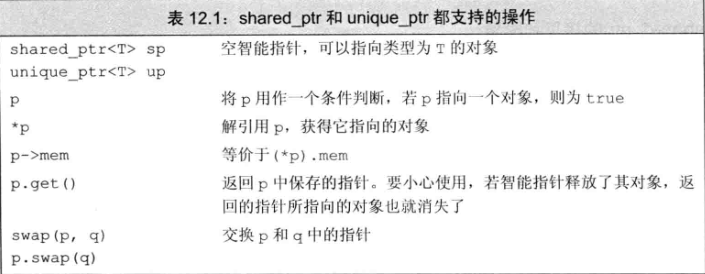
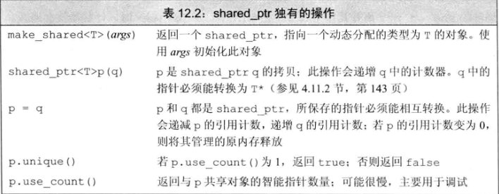

# 动态内存
* 除了自动和static对象外，C++还支持动态分配对象。动态分配的对象的生存期与他们在哪里创建是无关的，只有当显式地被释放时，这些对象才会销毁。
* 为了更安全地使用动态对象，标准库定义了两个智能指针类型来管理动态分配的对象。当一个对象应该被释放时，指向它的智能指针可以确保自动释放它。
* 静态内存用来保存局部static对象、类static数据成员以及定义在任何函数之外的变量。**栈内存用来保存定义在函数内的非static对象**。分配在静态或栈内存中的对象由编译器自动创建和销毁。对于栈对象，仅在其定义的程序块运行时才存在。而static对象在使用之前分配，在程序结束时销毁。
* 除了静态内存和栈内存，每个程序还拥有一个内存池。这部分内存被称作自由空间或堆。程序用堆来存储动态分配的对象——即，那些在程序运行时分配的对象。动态对象的生存期由程序来控制，也就是说，当动态对象不再使用时，我们的代码必须显式地销毁它们。
1. 动态内存与智能指针
* 动态内存的管理是通过一堆运算符来完成的：new，在动态内存中为对象分配空间并返回一个指向该对象的指针，我们可以选择对对象进行初始化；delete，接受一个动态对象的指针，销毁该对象，并释放与之关联的内存。
* 动态内存的使用很容易出问题，因为确保在正确的时间释放内存是极其困难的。有时我们会忘记释放内存，在这种情况下就会产生内存泄漏；有时在尚有指针引用内存的情况下我们就释放了它，在这种情况下就会产生引用非法内存的指针。
* 为了更容易（同时也更安全）地使用动态内存，新的标准库提供了两种智能指针类型来管理动态对象。智能指针的行为类似常规指针，重要的区别是它负责自动释放所指向的对象。新标准库提供的这两种智能指针的区别在于管理底层指针的方式：shared_ptr允许多个指针指向同一个对象；unique_ptr则“独占”所指向的对象。标准库还定义了一个名为weak_ptr的伴随类，它是一种弱引用，指向shared_ptr所管理的对象。这三种类型都定义在memory头文件中。
2. shared_ptr类
* 当我们创建一个智能指针时，必须提供额外的信息——指针可以指向的类型，
``` C++
shared_ptr<string> p1;  // shared_ptr，可以指向string
shared_ptr<list<int>> p2;  // shared_ptr，可以指向int的list
```
* 解引用一个智能指针返回它指向的对象。如果在一个条件判断中使用智能指针，效果就是检测他是否为空：
``` C++
// 如果p1不为空，检查它是否指向一个空string
if (p1 && p1->empty())
    *p1 = "hi";  // 如果p1指向一个空string，解引用p1，将一个新值赋予string
```


* make_shared函数

此函数在动态内存中分配一个对象并初始化它，返回指向此对象的shared_ptr。与智能指针一样，make_shared也定义在头文件memory中。
``` C++
// 指向一个值为42的int的shared_ptr
shared_ptr<int> p3 = make_shared<int>(42);
// p4指向一个值为“000000000”的string
shared_ptr<string> p4 = make_shared<string>(10, '9');
// p5指向一个值初始化的int，即，值为0
shared_ptr<int> p5 = make_shared<int>();
```
* make_shared用其参数来构造给定类型的对象。例如，调用make_shared<int>时传递的参数必须能用来初始化一个int，以此类推。如果我们不传递任何参数，对象就会进行值初始化。
* 通常用auto定义一个对象来保存make_shared的结果，这种方式较为简单。
``` C++
// p6指向一个动态分配的空vector<string>
auto p6 = make_shared<vector<string>>();
```
* shared_ptr的拷贝和赋值

当进行拷贝或赋值操作时，每个shared_ptr都会记录有多少个其它shared_ptr指向相同的对象。
``` C++
auto p = make_shared<int>(42);  // p指向的对象只有p一个引用者
auto q(p);  // p和q指向相同对象，此对象有两个引用者
```
* 每个shared_ptr都有一个关联的计数器，通常称其为引用计数。无论何时我们拷贝一个shared_ptr,计数器都会递增。例如，当用一个shared_ptr初始化另一个shared_ptr，或将它作为参数传递给一个函数，以及作为函数的返回值时，它所关联的计数器就会递增。
* 当我们给shared_ptr赋予一个新值或是shared_ptr被销毁（例如一个局部的shared_ptr离开其作用域）时，计数器就会递减。
* 一旦一个shared_ptr的计数器变为0，他就会自动释放自己所管理的对象：
``` C++
auto r = make_shared<int>(42);  // r指向的int只有一个引用者
r = q;  // 给i赋值，令它指向另一个地址
        // 递增q指向的对象的引用计数
        // 递减r原来指向的对象的引用计数
        // r原来指向的对象已经没有引用者，会自动释放
```
* shared_ptr自动销毁所管理的对象

sgared_ptr的析构函数会递减它所指向的对象的引用计数。如果引用计数变为0，shared_ptr的析构函数就会销毁对象，并释放它占用的内存。

* shared_ptr还会自动释放相关联的内存

当动态对象不再被使用时，shared_ptr类会自动释放动态对象，这一特性使得动态内存的使用变得非常容易。
``` C++
// factory返回一个shared_ptr,指向一个动态分配的对象
shared_ptr<Foo> factory(T arg) {
    // 恰当地处理arg
    // shared_ptr负责释放内存
    return make_shared<Foo>(arg);
}
```
由于factory返回一个shared_ptr，所以我们可以通过确保它分配的对象会在恰当的时刻被释放。例如，下面函数将factory返回的shared_ptr保存在局部变量中：
``` C++
void use_factory(T arg) {
    shared_ptr<Foo> p = factory(arg);
    // 使用p
} // p离开了作用域，它指向的内存会自动被释放掉
```
* 但是如果有其它shared_ptr也指向这块内存，它就不会被释放掉：
``` C++
void use_factory(T arg) {
    shared_ptr<Foo> p = factory(arg);
    // 使用p
    return p;  // 当我们返回p时，引用计数进行了递增操作
}  // p离开了作用域，但是它指向的内存不会被释放掉
```
* 使用动态内存的一个常见原因是允许多个对象共享相同的状态。
* 拷贝一个shared_ptr会递增其引用计数；将一个shared_ptr赋予另一个shared_ptr会递增赋值号右侧shared_ptr的引用计数，而递减左侧shared_ptr的引用计数。如果一个shared_ptr的引用计数变为0。它所指向的对象会被自动销毁。因此，对于由StrBlob构造函数分配的vector，当最后一个指向它的srtBlob对象被销毁时，它会随之被自动销毁。

3. 直接管理内存
* 运算符new分配内存，delete释放new分配的内存。
* 在自由空间分配的内存是无名的，因此new无法为其分配的对象命名，而是返回一个指向该对象的指针：
``` C++
int *pi = new int;  // pi指向一个动态分配的、未初始化的无名对象
```
* 默认情况下，动态分配的对象是默认初始化的，这意味着内置类型或者组合类型的对象的值是未定义的，而类类型对象将用默认构造函数进行初始化：
``` C++
string *ps = new string;  // 初始化空string
int *pi = new intl  // pi指向一个未初始化的int
```
* 可以使用直接初始化方式来初始化一个动态分配的对象。也可以使用传统的构造方式（使用圆括号），在新标准下，也可以使用列表初始化（使用花括号）
``` C++
int *pi = new int(1024);  // pi指向的对象的值为1024
string *ps = new string(10, '9');  // *ps为“9999999999”
// vector中有10个元素，值依次从0到9
vector<int> *pv = new vector<int>{0, 1, 2, 3, 4, 5, 6, 7, 8, 9};
string *ps1 = new string;  // 默认初始化为空string
string *ps = new string();  // 值初始化为string
int *pi1 = new int;  // 默认初始化，*pi1的值未定义
int *pi2 = new int();  // 值初始化为0；*pi2为0
```
* 如果我们提供了一个括号包围的初始化器，就可以使用auto从初始化器莱瑞段我们想要分配的对象的类型。由于编译器要用初始化器的类型来推断要分配的类型，只有当括号中仅有单一初始化器时才可以使用auto：
``` C++
auto p1 = new auto(obj);  // p指向一个与obj类型相同的对象，该对象用obj进行初始化
auto p2 = new auto{a, b, c};  // 错误：括号中只能由单个初始化器
```
p1的类型时一个指针，指向从obj自动推断出的类型。
