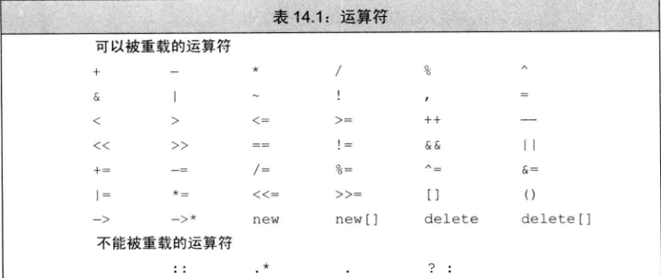
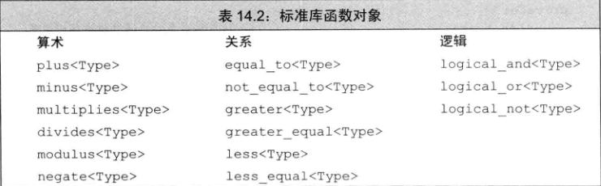
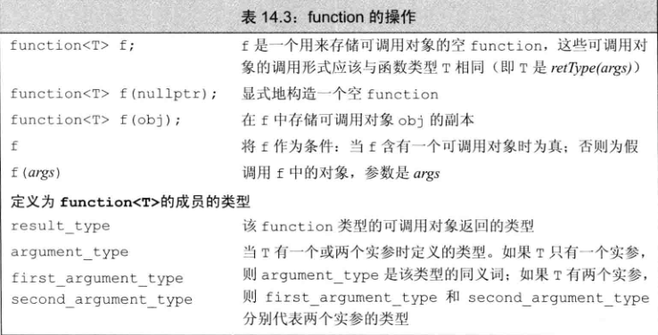

1. 基本概念
* 重载的运算符是具有特殊名字的函数：他们的名字由关键字operator和气候要定义的运算符号共同组成。和其他函数一样，重载的运算符也包含返回类型、参数列表以及函数体。
* 重载运算符函数的参数量与该运算符作用的运算对象数量一样多。一元运算符有一个参数，二元运算符有两个。
* 除了重载的函数条用运算符operator()之外，其它重载运算符不能含有默认实参。
* 当一个重载的运算符是成员函数时，this绑定到左侧对象。成员运算符函数的（显式）参数数量比运算对象的数量少一个。
* 当运算符作用域内置的运算对象时，我们无法改变该运算符的含义。


* 直接调用一个重载的运算符函数
``` C++
// 一个非成员运算符函数的等价调用
data1 + data2;  // 普通的表达式
operator+(data1, data2);  // 等价的函数调用
```

* 像调用其它成员函数一样显式地调用成员运算符函数。具体做法是，首先指定运行函数的对象（或指针）的名字，然后使用点运算符（或箭头运算符）访问希望调用的函数：
``` C++
data1 += data;  // 基于“调用”的表达式
data1.operator+=(data2);
```
* 这两条语句都调用了成员函数operator+=，将this绑定到data1的地址、将data2作为实参传入了函数。

* 一般不重载逗号运算符、取地址运算符、逻辑与和逻辑或运算符。

* 赋值运算符的行为与复合版本的类似：赋值之后，左侧运算对象和右侧运算对象的值相等，并且运算符应该返回它左侧运算对象的一个引用。

* 重载输出运算符

``` C++
ostream &operator<<(ostream &os, const Sales_data &item) {
    os << item.isbn() << " " << item.units_sold << " "
       << item.revenue << " " << item.avg_price();
    return os;
}
```
* 重载输入运算符
``` C++
istream &operator>> (istream &is, Sales_data &item) {
    double price;
    is >> item.bookNo >> item.units_sold >> price;
    if (is) item.revenue = item.units_sold * price;
    else item = Sales_data();
    return is;
}
```

* 重载算术运算符
``` C++
Sales_data operator+(const Sales_data &lhs, const Sales_data &rhs) {
    Sales_data sum = 1hs;
    sum += rhs;
    return sum;
}
```

* 重载相等运算符
``` C++
bool operator==(const Sales_data &lhs, const Sales_data &rhs) {
    return lhs.isbn() == rhs.isbn() && 
           lhs.units_sold == rhs.units_sold && 
           lhs.revenue == rhs.revenue;

}
bool operator!=(const Sales_data &lhs, const Sales_data &rhs) {
    return !(lhs == rhs);
}
```
* 赋值运算符
``` C++
class StrVec {
public:
    StrVec &operator=(std::initializer_list<srd::string>);
};

StrVec &StrVec::operator=(initializer_list<string> il) {
    // alloc_n_copy分配内存空间并从给定范围内拷贝元素
    auto data = alloc_n_copy(il.begin(), il.end());
    free();  // 销毁对象中的元素并释放内存空间
    elements = data.first;  // 更新数据成员使其指向新空间
    first_free = cap = data.second;
    return *this;
}
```

* 复合赋值运算符

``` C++
Sales_data& Sales_data::operator+=(const Sales_data &rhs) {
    units_sold += rhs.units_sold;
    revenue += rhs.revenue;
    return *this;
}
```
* 下标运算符（下标运算符必须是成员函数）

* 为了与下标的原始定义兼容，下标运算符通常以所访问元素的引用作为返回值，这样做的好处是下标可以出现在赋值运算符的任意一端。

* 如果一个类包含下标运算符，则它通常会定义两个版本：一个返回普通引用，另一个是类的常量成员并且返回常量引用。
``` C++
class StrVec {
public:
    std::string& operator[](std::size_t n){ return elements[n]; }
    const std::string& operator[] (std::size_t n) const { return elements[n]; }
private:
    std::string *elements;  // 指向数组首元素的指针
};

// 假设svec是一个StrVec对象
const StrVec cvec = svec;  // 把svec的元素拷贝到cvec中
// 如果svec中含铀元素，对第一个元素运行string的empty函数
if (svec.size() && svec[0].empty()) {
    svec[0] = "zero";  // 正确：下标运算符返回string的引用
    cvec[0] = "Zip";  // 错误：对cvec取下标返回的是常量引用
}
```
* 递增和递减运算符
* 为了与内置版本保持一致，前置运算符应该返回递增或递减后对象的引用
* 后置版本接受一个额外的（不被使用）int类型的形参。当我们使用后置运算符时，编译器为这个形参提供一个值为0的实参。这个形参的唯一作用就是区分迁至版本和后置版本的函数，而不是真的要在实现后置版本时参与运算。
``` C++
class StrBlobPtr {
public:
    // 递增和递减运算符
    StrBlobPtr& operator++();  // 前置运算符
    StrBlobPtr& operator--();

    StrBlobPtr operator++()；  // 后置运算符
    StrBlobPtr operator--();
    // 其它成员和之前的版本一致
};

// 前置版本：返回递增/递减对象的引用
StrBlobPtr& StrBlobPtr::operator++() {
    // 如果curr已经指向了容器的尾后位置，则无法递增它
    check(curr, "increment past end of StrBlobPtr");
    ++curr;  // 将curr在当前状态下向前移动一个元素
    return *this;
}
StrBlobPtr& StrBlobPtr::operator--() {
    // 如果curr是0，则继续递减它将产生一个无效下标
    --curr;  // 将curr在当前状态下向后移动一个元素
    check(curr, "decrement past begin of StrBlobPtr");
    return *this;
}

// 后置版本：递增/递减对象的值但是返回原值
StrBlobPtr StrBlobPtr::operator++(int) {
    // 此处无需检查有效性，调用前置递增运算时才需要检查
    StrBlobPtr ret = *this;  // 记录当前的值
    ++ *this;  // 向前移动一个元素，前置++需要检查递增的有效性
    return ret;  // 返回之前记录的状态
}
StrBlobPtr StrBlobPtr::operator--(int) {
    // 此处无需检查有效性，调用前置递减运算时才需要检查
    StrBlobPtr ret = *this;  // 记录当前的值
    --*this;  // 向后移动一个元素，前置--需要检查递减的有效性
    return ret;  // 返回之前记录的状态
}


StrBlobPtr p(al);  // p指向a1中的vector
p.operator++(0);  // 调用后置版本的operator++
p.operator++();  // 调用前置版本的operator

```

* 成员访问运算符
``` C++
class StrBlobPtr {
public:
    std::string& operator*() const
    {
        auto p = check(curr, "dereference past end");
        return (*p)[curr];
    }
    std::string* operator->() const
    {
        // 将实际工作委托给解引用运算符
        return &this->operator*();
    }
    // 其它成员与之前的版本一致
}
```
* 解引用运算符首先检查curr是否仍在作用范围内，如果是，则返回curr所指元素的一个引用。箭头运算符不执行任何自己的操作，而是调用解引用运算符并返回解引用结果元素的地址。

* 箭头运算符永远不能丢掉成员访问这个最基本的含义。当我们重载箭头时，可以改变的是箭头从哪个对象当中获取成员，而箭头获取成员这一事实则永远不变。
* 对于形如point->mem的表达式来说，point必须是指向类对象的指针或者是一个重载了ioerator->的类对象。根据point类型的不同，point->mem分别等价于
``` C++
(*point).mem;  // point是一个内置的指针类型
point.operator()->mem;  // point是类的一个对象
```


* 函数调用运算符
``` C++
struct absInt {
    int operator() (int val) const {
        return val < 0 ? -val: val;
    }
};

// 使用调用运算符的方式是：令一个absInt对象作用域一个实参列表，这一过程看起来非常像调用函数的过程：
int i = 42;
ansInt absObj;  // 含有函数调用运算符的对象
int ui = absObj(i);  // 将i传递给absObj.operator()
```
* 如果类定义了调用运算符，则该类的对象称作函数对象。因为可以调用这种对象，所以我们说这些对象“行为像函数一样”。


2. lambda是函数对象
* 对于我们传递给stable_sort作为最后的一个实参的lambda表达式来说：
``` C++
stable_sort(word.begin(), words.end(),
            [](const string &a, const string &b)
            { return a.size() < b.size();});
```
其行为类似于下面这个类的一个未命名对象
``` C++
class ShorterString {
public:
    bool operator() (const string &s1, const string &s2) const
    { return s1.size() < s2.size(); }
};
```
用这个类替代lambda表达式后，我们可以重写并重新调用stable_sort:
``` C++
stable_sort(words.begin(), words.end(), ShorterString());
```
* 第三个实参是新构建的ShorterString对象，当stable_sort内部的代码每次比较两个string时就会“调用”这一对象，此时该对象调用运算符的函数体，判断第一个string的大小小于第二个的时候返回true。

3. 标准库定义的函数对象
* 标准库定义了一组表示算术运算符、关系运算符和逻辑运算符的类，每个类分别定义了一个执行命名操作的调用运算符。
* 这些类都被定义为模板的形式，我们可以为其指定具体的应用类型，这里的类型即调用运算符的形参类型。
``` C++
plus<int> intAdd;  // 可执行加法的函数对
negate<int> intNegate;  // 可对int值取反的函数对象
// 使用intAdd::operator(int, int)求10和20的和
int sum = intAdd(10, 20);  // 等价于sum = 30
sum = intNegate(intAdd(10, 20));  // 等价于sum = 30
// 使用intNegate::operator(int)生成-10
// 然后将-10作为intAdd::operator(int, int)的第二个参数
sum = intAdd(10, intNegate(10));  // sum = 0
```

* 在算法中使用标准库函数对象
``` C++
// 如果svec是一个vector<string>
// 传入一个临时的函数对象用于执行两个string对象的>比较运算
sort(svec.begin(), scec.end(), greater<string>());
```
* 上面的语句将按照降序对svec进行排序。第三个实参是greater<string>类型的一个未命名对象，因此当sort比较元素时，不再是使用默认的<运算符，而是调用给定的greater函数对象。该对象负责在string元素之间执行>比较运算。

4. 可调用对象与function
* 不同类型可能具有相同的调用形式
``` C++
// 普通函数
int add(int i, int j) { return i + j; }
// lambda，其产生一个未命名的函数对象类
auto mod = [](int i, int j) { return i % j; }
// 函数对象类
struct divide {
    int operator() (int denominator, int divisor) {
        return denominator / divisor;
    }
};
```
* 上面这些可调用对象分别对其参数执行了不同的算术运算，尽管他们的类型各不相同，但是共享同一种调用形式。`int(int, int)`
* 我们需要定义一个函数表，用于存储只想这些可调用对象的“指针”。当程序需要执行某个特定的操作时，从表中查找该调用的函数。
* 我们可以 使用一个名为function的新的标准库类型解决上述问题，function定义在functional头文件中。

* function是一个模板，和我们使用过的其它模板一样，当创建一个具体的function类型时我们必须提供额外的信息。所谓额外的信息是指该function类型能够表示的对象的调用形式：
`function<int(int, int)>`

在这里我们声明了一个function类型，它可以表示接受两个int、返回一个int的可调用对象。因此，我们可以用这个新声明的类型表示任意一种桌面计算器用到的类型：
``` C++
#include <iostream>
#include <vector>
#include <array>
#include <string>
#include <queue>
#include <algorithm>
#include <set>
#include <map>
#include <typeinfo>
#include <memory>
#include <functional>
using namespace std;
// 普通函数
int add(int i, int j) { return i + j; }

// lambda，其产生一个未命名的函数对象类
auto mod = [](int i, int j) { return i % j;};
//函数对象类
struct divide {
    int operator() (int denominator, int divisor) {
        return denominator / divisor;
    }
};
int main(int argc, char** argv){
function<int(int, int)> f1 = add;  // 函数指针
function<int(int, int)> f2 = divide();  // 函数对象类的对象
function<int(int, int)> f3 = [](int i, int j) { return i * j; };  // lambda
function<int(int, int)> f4 = mod;
cout << f1(4, 2) << endl;  // 打印6
cout << f2(4, 2) << endl;  // 打印2
cout << f3(4, 2) << endl;  // 打印8
cout << f4(4, 2) << endl;  // 打印0
    return 0;
}

/*
output:
6
2
8
0
*/
```
* 使用这个function类型，我们可以重新定义map：
``` C++
map<string, function<int, int>> binops;

map<string, functiona<int, int>> binops = {
    {"+", add},  // 函数指针
    {"-", std::minus<int>()}, // 标准库函数对象
    {"/", divide()},  //用户定义的函数对象
    {"*", [](int i, int j) { return i * j;}},  // 未命名的lambda
    {"%", mod};  // 命名了的lambda对象
}
binops["+"](10, 5);  // 调用add(10, 5)
binops["-"](10, 5);  // 调用minus<int>对象的调用运算符
binops["*"](10, 5);  // 调用lambda函数对象
binops["%"](10, 5);  // 调用lambda函数对象
```
* 我们的map中包括5个元素，尽管其中的可调用对象的类型各不相同，我们仍然能够把所有这些类型都存储在同一个function<int, int>类型中。

* 重载的函数与function

我们不能（直接）将重载函数的名字存入function类型的对象中：
``` C++
int add(int i, int j) { return i + j; }
Sales_data add(const Sales_data&, const Sales_data&);
map<string, function<int(int, int)>> binops;
binops.insert({"+", add});  // 错误：哪个add？
```
* 解决上述二义性问题的一条途径是存储函数指针，而非函数的名字
``` C++
int (*fp)(int, int) = add;  // 指针所指向的add是接受两个int的版本
binops.insert({"+", fp});  // 正确，fp指向一个正确的add版本
```
* 同样，使用lambda来消除二义性
``` C++
// 正确：使用lambda来指定我们希望使用的add版本
binops.insert({"+", [](int a, int b) { return add(a, b); }});
```
* lambda内部的函数调用传入了两个int，因此该调用只能匹配接受两个int的add版本，而这也正是执行lambda时真正调用的函数。

5. 重载、类型转换与运算符

* 类型转换运算符是类的一种特殊成员函数，它负责将一个类类型的值转换成其他类型，类型转换函数的一般形式如下所示：
``` C++
operator type() const;
```

其中type表示某种类型。类型转换运算符可以面向任意类型（除了void之外）进行定义，只要该类型能作为函数的返回类型。因此我们不允许转换成数组或者函数类型，但允许转换成指针（包括数组指针及函数指针）或者引用类型。
* 类型转换运算符既没有显式的返回类型，也没有形参，而且必须定义成类的成员函数。类型转换运算符通常不应该改变待转换对象的内容，因此，类型转换运算符一般被定义成const成员。
``` C++
class SmallInt {
public:
    SmallInt(int i = 0): val(i) {
        if (i < 0 || i > 255) throw std::out_of_range("Bad SmallInt value");
    }
    operator int() const { return val; }
private:
    std::size_t val;
};
```
* 我们的SmallInt类既定义了向类类型的转换，也定义了从类类型向其它类型的转换。其中，构造函数将算术类型的值转换成SmallInt的对象，而类型转换运算符将SmallInt对象转换成int：
``` C++
SmallInt si;
si = 4;  // 首先将4隐式地转换成SmallInt, 然后调用SmallInt::operator=
si += 3;  // 首先将si隐式地转换成int，然后执行整数的加法
```
