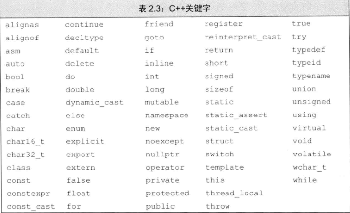
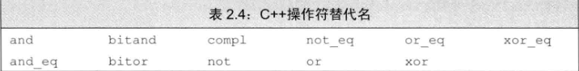

# 变量和基本类型
1. 算术类型的尺寸

| 类型 | 含义 | 尺寸 |
| :------: | :------: | :------: |
| bool | 布尔类型 | 1位 |
| char | 字符 | 8位(1字节) |
| short | 短整型 | 16位(2字节) |
| int | 整型 | 32位(4字节) |
| long | 长整型 | 32位(4字节) |
| long long | 长整型 | 64位(8字节) |
| float | 单精度浮点数 | 32位(4字节) |
| double | 双精度浮点数 | 64位(8字节) |
| long double | 扩展精度浮点数 | 96位(12字节) |
2. 初始化
    * 列表初始化:(以下初始化方法均能将a的值初始化为1)
    ``` C++
    int a = 1;
    int a = {1}
    ```
    * 如果定义变量时没有指定初始值，则变量被默认初始化。定义于任何函数体之外的变量被初始化为0.
    * 定义在函数体内部的内置类型变量将不被初始化。
    * 绝大多数类都支持无须显式初始化而定义对象，这样的类提供了一个合适的默认值。string类规定如果没有指定初值则生成一个空串。
    * 未被初始化的变量含有一个不确定的值，使用未初始化变量的值是一种错误的编程行为并且难以调试，使用未初始化的变量将带来无法估计的后果。
3. 声明和定义
    * 声明使得名字为程序所知，一个文件如果想使用别处定义的名字，则必须包含对那个名字的声明。而定义负责创建与名字关联的实体。
    * 如果想声明一个变量而非定义它，就在变量名前添加关键字`extern`，而且不要显式地初始化变量。
    `extern int i; // 声明i而非定义i`
    `int j; // 声明i并且定义i`
    * `extern`语句如果包含初始值就不再是声明，而变成定义了。
    `extern double pi = 3.1416;  // 定义`
    * 在函数体内部，如果试图初始化一个由extern关键字标记的变量，将引发错误。
    * 变量能且只能被定义一次，但是可以被多次声明。
4. 静态类型
    * C++是一种静态类型语言，其含义是在编译阶段检查类型。其中，检查类型的过程被称为类型检查。程序越复杂，静态类型检查越有助于发现问题。然而，前提是编译器必须知道每一个实体对象的类型，这就要求我们在使用某个变量之前必须声明其类型。
5. C++关键字
    
6. C++操作符替代名
    
7. 嵌套的作用域
    ``` C++
    #include <iostream>
    int reused = 42;  // reused拥有全局作用域
    int main(){
        int unique = 0;  // unique拥有块作用域
        std::cout << reused << " " << unique << std::endl;  // 42 0
        int reused = 0;  //新建局部变量reused，覆盖了全局变量reused
        std::cout << reused << " " << unique << std::endl;  // 0 0
        std::cout << ::reused << " " << unique << std::endl;  // 42 0
        return 0;
    }
    ```
    * 第一个输出，出现在局部变量reused定义之前，因此这条语句使用全局作用域中定义的名字reused，输出42 0；
    * 第二个输出，发生在局部变量reused定义之后，此时局部变量reused正在作用域内，因此，第二条输出语句使用的是局部变量reused而非全局变量，输出0 0；
    * 第三个输出，使用域操作符来覆盖默认的作用域规则，因为全局作用域本身没有名字，所以当作用域操作符的左侧为空时，向全局作用域发出请求获取作用域操作符右侧名字对应的变量。因此第三条语句使用全局变量reused，输出42 0.
8. 引用
    * 引用(reference)为对象起了另外一个名字，引用类型引用(refers to)另外一种类型。通过将声明符携程&d的形式来定义引用类型，其中d是声明的变量名：
    ``` C++
    int ival = 1024;
    int &refVal = iVal;  // refVal指向ival(是ival的另一个名字)
    int &refVal2;  // 报错: 引用必须被初始化 
    int i = 1024, i2 = 2048;  // i和i2都是int
    int &r = i, r2 = i2;  // r是一个引用，与i绑定在一起，r2是int
    int r3 = 1024， &ri = i3;  // i3是int，ri是一个引用，与i3绑定在一起
    int &r3 = i3, &r4 = i2;  // r3和r4都是引用
    int &refVal4 = 10;  // 错误：引用类型的初始值必须是一个对象
    double dval = 3.14;
    int &refVal5 = dval;  // 错误：此处引用类型的初始值必须是int型对象
    ```
    * 在初始化变量时，初始值会被拷贝到新建的对象中。然而定义引用时，程序把引用和它的初始值绑定在一起，而不是将初始值拷贝给引用。
    * 一旦初始化完成，引用将和它的初始化对象一直绑定在一起。
    * 因为无法令引用重新绑定到另外一个对象，因此引用必须初始化。
    * 引用并非对象，它只是为一个已经存在的对象所起的另外一个名字。
    * 为引用赋值，实际上是把值赋给了与引用绑定的对象。获取引用的值，实际上是获取了与引用绑定的对象的值。
    * 引用只能绑定在对象上，而不能与字面值或者某个表达式的计算结果绑定在一起。
9. 指针
    * 指针是“指向(point to)”另外一种类型的复合类型。与引用类似，指针也实现了对其他对象的间接访问。然而指针与引用相比又有很多不同点。其一，指针本身就是一个对象，允许对指针赋值和拷贝，而且在指针的生命周期内它可以先后指向几个不同的对象。其二，指针无须在定义时赋初值，在块作用域内定义的指针如果没有被初始化，也将会拥有一个不确定的初值。
    * 如果在一条语句中定义了几个指针变量，每个变量前面都必须有符号“*”。
    * 指针存放着某个对象的地址，要想获取该地址，需要使用取地址符(操作符&)
    * 引用不是对象，没有实际的地址，所以不能定义指向引用的指针。
    * 指针的值（即地址）应属于下列4种状态之一：
    
    （1）指向一个对象。
    
    （2）指向紧邻对象所占空间的下一个位置。

    （3）空指针，意味着指针没有指向任何对象。

    （4）无效指针，也就是上述情况之外的其他值。
    * 利用指针访问对象：如果指针指向了一个对象，则允许使用解引用符（操作符*）来访问该对象：
    ``` C++
    int ival = 42;
    int *p = &ival;  // p存放着变量ival的地址，或者说p是指向变量ival的指针。
    cout << *p;  // 由符号*得到指针p所指对象，输出42
    *p = 0;  // 由符号*得到指针p所指的对象，即可经由p为变量ival赋值
    cout << *p;  // 输出0
    cout << ival;  // 输出0
    ```
    * 由如上程序所示，为*p赋值实际上是为p所指的对象赋值。这样，通过指针p，我们就将变量ival的值进行了修改。
    * 指针与地址：
    ``` C++
    #include <iostream>
    using namespace std;
    int main(){
        int val = 42;
        int *x = &val;
        int *p = x;
        cout << val << " " << *x << " " << *p << endl;  // 42 42 42
        cout << &val << ' ' << x << endl;  // 0x61fef8 0x61fef8
        cout << &x << " " << p << endl;  // 0x61fef4 0x61fef8
        return 0;
    }
    ```
    有这段程序的输出结果可以看出

    （1）指针x，指针p，都指向变量val的地址；

    （2）虽然指针p被赋值为指针x，但是指针p不指向x的地址，而是指向了指针x指向的那个地址，即变量val的地址。
    * 符号的多重含义
    ``` C++
    int i = 42;
    int &r = i;  // &紧随类型名出现，因此是声明的一部分，r是一个引用
    int *p;  // *紧随类型名出现，因此是声明的一部分，p是一个指针
    p = &i;  // &出现在表达式中，是一个取地址符
    *p = i;  // *出现在表达式中，是一个解引用符
    int &r2 = *p;  // &是声明的一部分，*是一个解引用符
    ```
    在声明语句中，&和*用于组成复合类型；在表达式中，他们的角色又转变成运算符。在不同场景下出现的虽然是同一个符号，但是由于含义截然不同，所以我们完全可以把它当作不同的符号来看待。
    * 生成空指针的几种方法
    ``` C++
    int *p1 = nullptr;  // 等价于int *p1 = 0;
    int *p2 = 0;  // 直接将p2初始化为字面常量0；
    int *p3 = NULL;  // 等价于int *p3 = 0;  首先需要#include <cstdlib>
    ```
    在新标准下，现在的C++程序最好使用nullptr，同时尽量避免使用NULL。
    * g给指针赋值，就是令它存放一个新的地址，从而指向一个新的对象。
    * void* 是一种特殊类型的指针，可用于存放任意对象的地址。一个void*指针存放着一个地址，这一点和其他指针类似，但是我们对该地址中到底是个什么类型的对象并不了解。
    * 不能直接操作void*指针所指的对象，因为我们并不知道这个对象到底是什么类型，也就无法确定在这个对象上做哪些操作。
10. 复合类型的声明
    * 定义变量包括一个基本数据类型和一组声明符。在同一条定义语句中，虽然基本数据类型只有一个，但是声明符的形式可以不同。
    * 类型修饰符(*或&)作用于本次定义的单个变量而非全部变量。
    ``` C++
    int i = 1024, *p = &i, &r = i;  // i是一个int型的数，p是一个int型指针，r是一个int型引用
    int* p1, p2;  // p1是指向int的指针，p2是int
    ```
    * 通过*的个数可以区分指针的级别。也就是说，** 表示指向指针的指针，***表示指向指针的指针的指针。
11. 指向指针的引用
    ``` C++
    int i = 42;
    int *p;  // p是一个int型指针
    int *&r = p;  // r是一个对指针p的引用
    r = &i;  // r引用了一个指针，因此给r赋值&i就是令p指向i
    *r = 0;  // 解引用r得到i，也就是p指向的对象，将i的值改为0
    // 疑问：&*p是什么？
    ```
    * 要理解r的类型是什么，最简单的办法就是从右向左阅读r的定义。**离变量名最近的符号(此例中是&r的符号&)对变量的类型有最直接的影响，因此r是一个引用。**声明符的其余部分用以确定r引用的类型是什么，此例中的符号*说明r引用的是一个指针。最后，声明的基本数据类型部分指出r引用的是一个int指针。
12. const限定符
    * 使用const修饰的变量必须被初始化，编译器将在编译过程中把用到该变量的地方都替换成对应的值。
    * const对象被设定为仅在文件内有效，当多个文件中出现了同名的const变量时，其实等同于在不同的文件中分别定义了独立的变量。
    * 如果让const定义的变量在文件之间共享，也就是说，只在一个文件中定义从const，而在其它多个文件中声明并使用它。解决的办法是，对于const变量不管是声明还是定义都添加extern关键字，这样只需要定义一次就可以了。
    * const的引用：可以把引用绑定到const对象上，就像绑定到其它对象上一样，我们称之为对常量的引用。与普通引用不同的是，对常量的引用不能被用作修改它所绑定的对象。
    ``` C++
    const int ci = 1024;
    const int &r1 = ci;  // 正确：引用及其对应的对象都是常量
    r1 = 42;  // 错误：r1是对常量的引用
    int &r2 = ci;  // 错误：试图让一个非常量引用指向一个常量对象
    ```
    * 常量表达式是指值不会改变并且在编译过程就能得到计算结果的表达式。显然，字面值属于常量表达式，用常量表达式初始化的const对象也是常量表达式。
13. 自定义数据结构
    * 形式
    ``` C++
    struct Sales_data {
        std::string bookNo;
        unsigned units_sold = 0;
        double revenue = 0.0;
    };
    // 这是标准的定义方式, 如果要声明一个实例对象，用struct Sales_data a; 或者Sales_data a; 均可。

    struct Sales_data {
        std::string bookNo;
        unsigned units_sold = 0;
        double revenue = 0.0;
    }S_d;
    // S_d为该结构体的一个实例对象

    struct Sales_data {
        std::string bookNo;
        unsigned units_sold = 0;
        double revenue = 0.0;
    }S_d;
    // S_d为该结构体的一个别名，可以使用S_d a; 来声明一个实例。
    ```
14. 预处理器
    * 确保头文件多次包含仍能安全工作的常用技术是预处理器。预处理器是在编译之前执行的一段程序，可以部分地改变我们所写的程序。
    * \#define指令把一个名字设定为预处理变量，另外两个指令分别检查某个指定的预处理变量是否已经定义：#ifdef当且仅当变量已定义时为真，#ifndef放且仅当变量未定义时为真。一旦检查结果为真，则执行后续操作直至遇到#endif指令为止。
    * 代码实例如下：
    ``` C++
    #ifndef SALES_DATA_H
    #define SALES_DATA_H
    #include <string>
    struct Sales_data {
        std::string bookNo;
        unsigned units_sold;
        double revenue = 0.0;
    };
    #endif
    /*
    * 第一次包含Sales_data.h时，#ifndef的检查结果为真，预处理器将顺序执行后面的* 操作直至遇到#endif为止。此时，预处理变量SALES_DATA_H的值将变为已定义，而且* Sales_data.h也会被拷贝到我们的程序中来。后面如果再一次包含Sales_data.h，* 则#ifndef的检查结果将为假，编译器将忽略#ifndef到#endif之间的部分。
    */
    ```
    * 整个程序中的预处理变量包括头文件保护符必须唯一，通常的做法是基于头文件中类的名字来构建保护符的名字，以确保其唯一性。为了避免与程序中的其他实体发生名字冲突，一般把预处理变量的名字全部大写。

    


