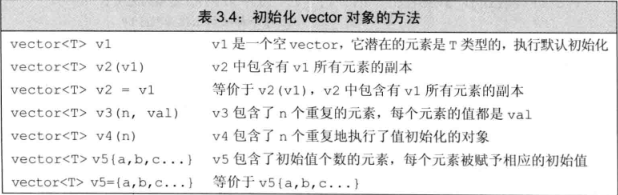
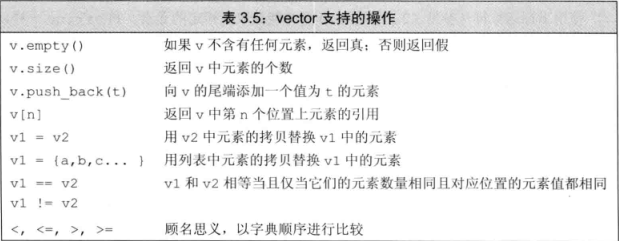
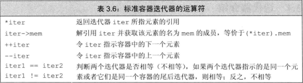
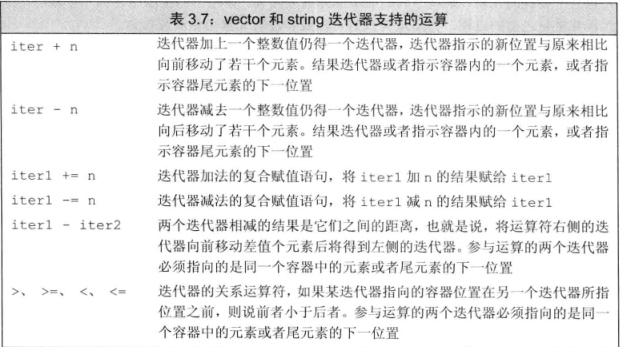
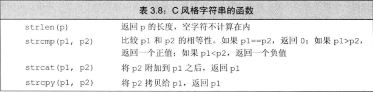

# 第三章 字符串、向量和数组
1. 命名空间的using 声明
* 每个名字都需要独立的using声明，每个using声明引入命名空间中的一个成员。
* 头文件中不应该包含using声明。
``` cpp
int a = 1;
int main(){
    int a = 2;
    cout << a << endl;  // 2
    cout << ::a << endl;  // 1
    return 0;
    // 通过作用域运算符“::”，可以访问函数外部的变量a的值。
}
```
2. string
* 初始化：
``` C++
string s1; // 默认初始化，s1是一个空的字符串
string s2(s1);  // s2是s1的副本
string s2 = s1; // 等价于string s2(s1)，s2是s1的副本
string s3("value")  // s3是字面值"value"的副本，除了字面值最后的那个空字符外
string s3 = "value";  // 等价于s3("value")，s3是该字符串字面值的副本
string s4(n, 'c'); //把s4初始化为由连续n个字符c组成的串
```
* 操作
``` C++
os << s;  // 将s写道输出流os中，返回os
is >> s;  // 从s中读取字符串赋给s，字符串以空白分隔，返回is
getline(is, s);  // 从is中读取一行赋给s，返回is
s.empty();  // s为空返回true，否则返回false
s.size();  // 返回s中字符的个数
s[n];  // 返回s中第n个字符的引用，位置n从0计起
s1+s2  // 返回s1和s2连接后的结果
s1=s2  // 用s2的副本代替s1中原来的字符
s1==s2  // 如果s1和s2中所含的字符完全一样(对大小写敏感)，则返回true，否则返回false
<, <=, >, >=  // 利用字符在字典中的顺序进行比较，且对字母的大小写敏感
```
当我们读取位置数量的string对象的时候，可以使用`while(cin >> word)`语句，反复读取，直至到达文件末尾。
使用可以不忽略空格，制表符等，读取一整行
``` C++
string line;
while(getline(cin, line))   cout << line << endl;
```
* string::size_type类型
是一个无符号类型的值，而且能足够存放下任何string对象的大小。所有用于存放string类的size函数返回的变量，都应该是string::size_type类型。
`auto len = line.size(); // len的类型是string::size_type`
简单来说,size_t类型就是专门为了表示string对象大小的数据类型，和unsigned int差不多。
* string相加操作
当把string对象和字符字面值以及字符串字面值混在一条语句中使用时，必须保证每个加法运算符（+）的两侧的运算对象至少有一个是string:
``` C++
string s4 = s1 + ", ";  // 正确
string s5 = "Hello" + ", "; // 错误:两个运算对象都不是string
```
* 处理字符

注：需要添加cctype头文件
* C++和C的头文件之间的区别与联系
C++标准库中除了定义C++语言特有的功能外，也兼容了C语言的标准库。C语言的头文件形如name.h，C++九江这些文件命名为cname。也就是去掉了.h后缀，而在文件名name之前添加了字母c，这里的c表示这是一个属于C语言标准的头文件。特别的，在名为cname的头文件中定义的名字从属于命名空间std，而定义在名为.h的头文件中的则不然。
3. vector
* 定义和初始化vector对象

``` C++
vector<int> ivec;  //初始状态为空
vector<int> ivec2(ivec);  // 把ivec的元素拷贝给ivec2
vector<int> ivec3 = ivec;  // 把ivec的元素拷贝给ivec3
vector<string> svec(ivec2);  // 错误，数据类型不匹配
vector<int> v1(10);  // v1中有10个元素，每个元素的值都是0
vector<int> v2{10};  // v1中有1个元素，该元素的值都是10
vector<int> v3(10, 1);  // v1中有10个元素，每个元素的值都是1
vector<int> v4{10, 1};  // v1中有2个元素，值分别是10和1
```
* vector的常用操作

4. 迭代器
* 获取迭代器不是使用取地址符，有迭代器的类型的同时拥有返回迭代器的成员。begin()成员负责返回指向第一个元素的迭代器，end成员则负责返回指向容器“尾元素的下一位置”的迭代器。
* 迭代器运算符

* 解引用和成员访问操作
`(*it).empty()  // 解引用it，然后调用结果对象的empty成员`
箭头运算符(->)把解引用和成员访问两个操作结合在一起，也就是说，it->mem和(*it).mem表达的意思相同
* 迭代器运算

5. 数组
* 定义和初始化内置数组
``` C++
int sz = 42;  
int arr[10];  // 含有10个整数的数组
int *parr[sz];  // 含有42个整型指针的数组
int *ptrs[10];  // ptrs是含有10个整型指针的数组
int &refs[10] = /* ? */;  // 错误，不存在数组的引用
int (*Parray)[10] = &arr;  // Parray指向一个含有10个整数的数组
int (&arrRef)[10] = arr;  // arrRef 引用一个含有10个整数的数组
```
Parray的含义：首先是原括号括起来的部分，*Parray意味着Parray是个指针，接下来观察右边，可以知道Parray是个指向大小为10的数组的指针，最后观察左边，知道数组中的元素是int。
因此，Parray是一个指针，它指向一个int数组，数组中包含10个元素。同理，(&arrRef)表示arrRef是一个引用，它引用的对象是一个大小为10的数组，数组中的元素类型是int。
* 标准库函数begin和end
``` C++
int ia[] = {0, 1, 2, 3, 4, 5, 6, 7, 8, 9};
int *beg = begin(ia);  // 指向ia首元素的指针
int *last = end(ia);  // 指向arr尾元素的下一位置的指针
```
* 解引用和指针运算的交互
``` C++
int ia[] = {0, 2, 4, 6, 8};  // 含有5个整数的数组
int last = *(ia + 4); // 把last初始化成8，也就是ia[4]的值
```
表达式*(ia + 4)计算ia前进4个元素后的新地址，解引用该结果指针的效果等价于表达式ia[4].
5. C风格字符串
* C风格字符串存放在字符数组中并且以空字符结束，以空字符结束的意思是在字符串最后一个字符后面跟着一个空字符('\0')，一般利用指针来操作这些字符串。

* 与旧代码的接口
``` C++
string s("Hello World");  // s的内容是Hello World
char *str = s;  // 错误，不能用string对象初始化char* 
const char *str = s.c_str();  // 正确
```
c_str()函数的返回值是一个C风格的字符串
* 使用数组初始化vector对象
``` C++
int int_arr[] = {0, 1, 2, 3, 4, 5};
vector<int> ivec(begin(int_arr), end(int_arr));

//拷贝三个元素：int_arr[1], int_arr[2], int_arr[3]
vector<int> subVec(int_arr + 1, int_arr + 4);
```
6. 多维数组
* 严格来说，C++语言中并灭有多维数组，通常所说的多维数组其实是数组的数组。
``` C++
int ia[3][4];  // 大小为3的数组，每个元素都是含有4个整数的数组

// 大小为10的数组，它的每个元素都是大小为20的数组
// 这些数组的元素是含有30个整数的数组
int arr[10][20][30] = {0};  // 将所有元素初始化为0
```
* 多维数组的初始化
``` C++
// 显式地初始化每行的首元素，其他未列出的元素执行默认值初始化（值为0）
int ia[3][4] = {{0}, {4}, {8}};

//显式地初始化第一行，其他元素执行默认值初始化
int ix[3][4] = {0, 3, 6, 9};
```
* 使用范围for语句处理多维数组
``` C++
size_t cnt = 0;
for(auto &row: ia)  // 对于外层数组中的每一个元素
    for(auto &col: row) {    //对于内层数组的每一个元素
        col = cnt;  // 将下一个值赋给该元素
        ++cnt;  // 将cnt加1
    }
```
如果不用引用类型，程序将无法通过编译
``` C++
for(auto row: ia)
    for(auto col: row)
```
第一个循环遍历ia的所有元素，这些元素实际上是大小为4的数组。因为row不是引用类型，所以编译器初始化row时会自动将这些数组形式的元素转换成指向该数组内首元素的指针。这样得到的row的类型就是int*，显然内层的循环就不合法了，因为编译器试图在一个int*内遍历。
* 指针和多维数组
* 当程序使用多维数组的名字时，也会自动将其转换成指向数组首元素的指针。
``` C++
int ia[3][4];  // 大小为3的数组，每个元素是含有4个整数的数组
int (*p)[4] = ia;  // p指向含有4个整数的数组
p = &ia[2];  // p指向ia的尾元素
```
对于int (\*p)[4] = ia; 首先明确(\*p)意味着p是一个指针。接着观察右边发现，指针p所指的是一个维度为4的数组；再观察左边知道，数组中的元素是整数。因此，p就是指向含有4个整数的数组的指针。

其中，在上述声明中，圆括号必不可少
``` C++
int *ip[4];  // 整型指针的数组
int (*ip)[4];  // 指向含有4个整数的数组
```


