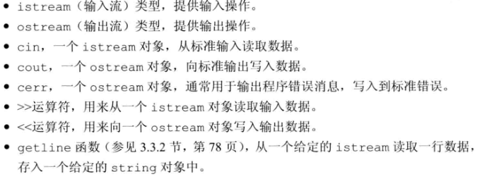
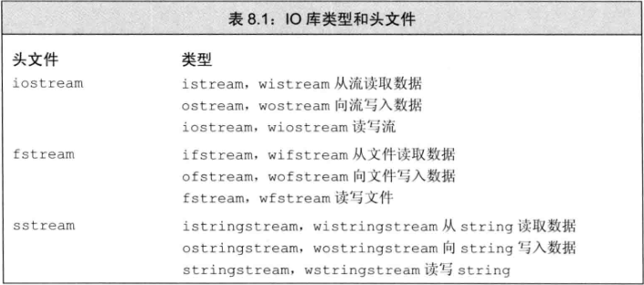
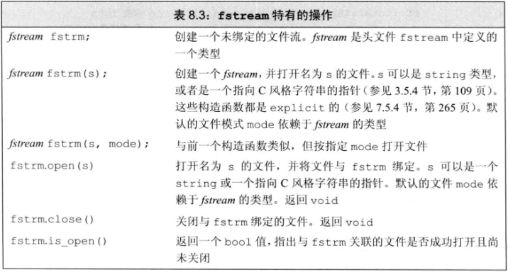
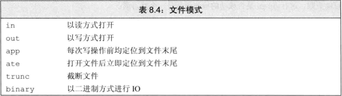
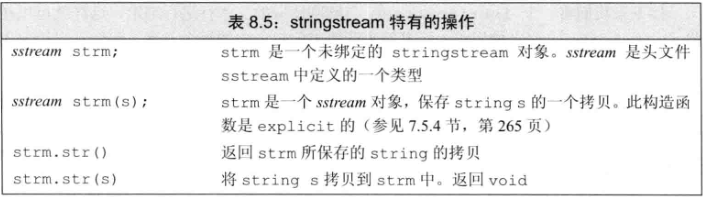

**C++语言不直接处理输入输出，而是通过一族定义在标准库中得类型来处理IO。这些类型支持从设备读取数据、向设备写入数据得IO操作，设备可以是文件、控制台窗口等。还有一些类型允许内存IO，即，从string读取数据，向string写入数据。**
1. IO类
* 常见的IO库：

* IO库类型和头文件

* 刷新输出缓冲区
``` C++
cout << "hi!" << endl;  // 输出hi和一个换行，然后刷新缓冲区
cout << "hi!" << flush; // 输出hi，然后刷新缓冲区，不附加任何额外字符
cout << "hi!" << ends;  // 输出hi和一个空字符，然后刷新缓冲区
```
* 如果想在每次输出操作后都刷新缓冲区，我们可以使用unitbuf操纵符。它告诉流在接下来得每次写操作之后都进行一次flush操作。而nounitbuf操纵符则重置流，十七恢复使用正常的系统管理的缓冲区刷新机制：
``` C++
cout << unitbuf;  // 所有输出操作后都会立即刷新缓冲区
cout << nounitbuf;  // 回到正常的缓冲方式
```
2. 文件输入输出
* ifstream: 从一个给定文件读取数据；
* ofstream: 向一个给定文件写入数据；
* fstream: 可以读写给定文件；

* 我们可以用IO运算符(<<和>>)来读写文件，可以用getline从一个ifstream读取数据。
* fstream操作

3. 使用文件流对象
* 当我们要读写一个文件时，可以定义一个文件流对象，并将对象与文件关联起来。每个文件流类都定义了一个名为open的成员函数，它完成一些系统相关的操作，来定位给定的文件，并视情况打开为读或写模式。
``` C++
ifstream in(ifile);  // 构造一个ifstream并打开给定文件
ofstream out;  // 输出文件流未关联到任何文件
```
* 成员函数open和close
``` C++
ifstream in(ifile);  // 构筑一个ifstream并打开给定文件
ofstream out;  // 输出文件流未与任何文件关联
out.open(ifile + ".copy");  // 打开指定文件
if (out)  // 检查open是否成功，如果open成功，我们可以使用文件了

// 为了将文件流关联到另外一个文件，必须首先关闭已经关联的文件。一旦文件成功关闭，我们可以打开新的文件。
in.close();  // 关闭文件
in.open(ifile + "2");  // 打开另一个文件
```
当一个fstream对象离开其作用域时，与之关联的文件会自动关闭。
4. 文件模式
* 
* 打开文件的限制：
(1) 只可以对ofstream或fstream对象设定out模式。

(2) 只可以对ifstream或fstream对象设定in模式。

(3) 只有当out被设定时才可以设定trunc模式。

(4) 只要trunc没有被设定，就可以设定app模式。在app模式下，即使没有显式指定out模式，文件也总是以输出方式打开。

(5) 默认情况下，即使我们没有指定trunc，以out模式打开的文件也会被截断。为了保留以out模式打开的文件的内容，我们必须同时指定app模式，这样只会将数据追加写到文件末尾;或者同时指定in模式,即打开文件同时进行读写操作.

(6) ate和 binary模式可用于任何类型的文件流对象，且可以与其他任何文件模式组合使用。

* 默认情况下，当我们打开一个 ofstream 时，文件的内容会被丢弃。阻止一个ofstream清空给定文件内容的方法是同时指定app模式:
``` C++
// 在这几条语句中，file1都被截断
ofstream out("file1");  // 隐含以输出模式打开文件并截断文件
ofstream out2("file1", ofstream::out);  // 隐含地截断文件
ofstream out3("file1", ofstream::out | ofstream::trunc);
// 为了保留文件内容，我们必须显式指定app模式
ofstream app("file2", ofstream::app);  // 隐含为输出模式
ofstream app2("file2", ofstream::out | ofstream::app);
```
* 每次调用open时都会确定文件模式
对于一个给定流，每当打开文件时，都可以改变其文件模式。
``` C++
ofstream out;  // 未指定文件打开模式
out.open("scratchpad");  // 模式隐含设置为输出和截断
out.close();  // 关闭out, 以便我们将其用于其他文件
out.open("precious", ofstream::app);  // 模式为输出和追加
out.close();
// 第一个open调用未显式指定输出模式，文件隐式地以out模式打开。通常情况下，out模式意味着同时使用trunc模式。因此，当前目录下名为scratchpad的文件内容将被清空。当打开名为precious的文件时，我们指定了append模式。文件中已有的数据都得以保留，所有写操作都在文件末尾执行。
```
5. string流
* istringstream从string读取数据，ostringstream向string写入数据，而头文件stringstream既可从string读数据也可向string写数据。
* stringstream特有的操作

* 使用istringstream
``` C++
//数据格式：
// morgan 2015552368 8625550123
// drew 9735550130
// lee 60955501322015550175 8005550000
struct PersonInfo {
    string name;
    vector<string> phones;
};

string line, word;  // 分别保存来自输入的一行和单词
vector<PersonInfo> people;  // 保存来自输入的所有记录
// 逐行从输入读取数据、直至cin遇到文件尾(或者其他错误)
while (getline(cin, line)) {
    PersonInfo info;  // 创建一个保存此记录数据的对象
    istringstream record(line);  // 将记录绑定到刚读入的行
    record >> info.name;  // 读取名字
    while (record >> word)  // 读取电话号码
        info.phones.push_back(word);  // 保持它们
    people.push_back(info);  // 将此记录追加到文件末尾
}

```
* 使用ostringstream
``` C++
for (const auto &entry: people) {  // 对people中每一项
    ostringstream formatted, badNums;  // 每个循环步创建的对象
    for(const auto &nums: entry.phones) {  // 对每个数
        if (!valid(nums)) {
            badNums << " " << nums;  // 将数的字符串形式存入badNums
        } else{
            // 将格式化的字符串"写入"formatted
            formatted << " " << format(nums);
        }
    }
    if (badNums.str().empty())  // 没有错误的数
        os << entry.name << " "  // 打印名字
           << formatted.str() << endl;  // 和格式化的数
    else  // 否则，打印名字和错误的数
        cerr << "input error: " << entry.name
             << " invalid number(s) " << badNums.str() << endl;

}
```