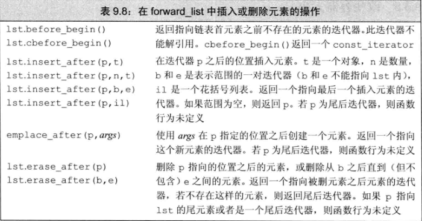

1. 顺序容器
* 顺序列表容器类型

| 类型   |      特征      |
|:----------:|:-------------|
| vector |  可变大小数组。支持快速随机访问。在尾部之外的为止插入或者删除元素可能很慢 |
| deque | 双端队列。支持快速随机访问。在头尾为止插入/删除速度很快 |
| list | 双向链表。只支持双向顺序访问。在lis中任何位置及逆行插入/删除操作速度都很快 |
| forward_list | 单向链表。只支持单向顺序访问。在链表人格位置进行插入/删除操作速度都很快 |
| array | 固定大小数组。支持快速随机访问。不能添加或者删除元素 |
| string | 与vector相似的容器，但专门用于保存字符。随机访问快，在尾部插入/删除速度快 |

* 容器操作

| 类型别名   |      操作      |
|:----------:|:-------------|
| iterator | 此容器类型的迭代器类型 |
| const_iterator | 可以读取元素，但是不能修改元素的迭代器类型 |
| size_type | 无符号整数类型，足够保存此种容器类型最大金额能容器的大小 |
| difference_type | 带符号整数类型，足够保存两个迭代器之间的距离 |
| value_type | 元素类型 |
| reference | 元素的左值类型：与value_type含义相同 |
| const_reference | 元素的const左值类型(即，const value_type&) |

| 构造函数   |      操作      |
|:----------:|:-------------|
| C c | 默认构造函数，构造空容器(array) |
| C c1(c2); | 构造c2的拷贝c1 |
| C c(b, e); | 构造c，将迭代器b和e指定的范围内的元素拷贝到c |
| C c{a, b, c}; | 列表初始化c |

| 赋值与swap   |      操作      |
|:----------:|:-------------|
| c1 = c2 | 将c1中的元素替换为c2中的元素 |
| c1 = {a, b, c} | 将c1中的元素替换为列表中元素 |
| a.swap(b) | 交换a和b的元素 |
| swap(a, b) | 与a.swap(b)等价 |

| 大小   |      操作      |
|:----------:|:-------------|
| c.size() | c中元素的数目 |
| c.max_size() | c可以保存的最大元素数目 |
| c.empty() | 若c中存储了元素，返回false，否则返回true |

| 添加/删除元素   | 操作 |
|:----------:|:-------------|
| c.insert(args) | 将args中的元素拷贝进c |
| c.emplace(inits) | 使用inits构造c中的一个元素 |
| c.erase(args) | 删除args指定的元素 |
| c.clear() | 删除c中的所有元素，返回void |

| 关系运算符   | 操作 |
|:----------:|:-------------|
| ==, != | 所有容器都支持相等(不等)运算符 |
| <, <=, >, >= | 关系运算符(无序关联容器不支持) |

| 获取迭代器   | 操作 |
|:----------:|:-------------|
| c.begin(), c.end() | 返回指向c的首元素和尾元素之后 |
| c.cbegin(), c.cend() | 返回const_iterator |

| 反向容器的额外成员(不支持forward_list)   | 操作 |
|:----------:|:-------------|
| reverse_iterator | 按逆序寻址元素的迭代器 |
| const_reverse_iterator | 不能修改元素的逆序迭代器 |
| c.rbegin(), c.rend() | 返回指向c的尾元素和首元素之前位置的迭代器 |
| c.crbegin(), c.crend() | 返回const_reverse_iterator |

2. 迭代器
* 一个迭代器范围由一堆迭代器表示，两个迭代器分别指向同一个容器中的元素或者是尾元素之后的位置。这两个迭代器哦通常被称为begin和end，或者是first和last，他们标记了容器中元素的一个范围。虽然第二个迭代器通常被称为last，但是这种叫法有误导，因为**第二个迭代器从来都不会指向范围内的最后一个元素，而是指向尾元素之后的位置**。这种元素范围被称为左闭合区间，其标准数学描述为$ [begin, end) $，表示范围自begin开始，于end之前结束。迭代器begin和end必须指向相同的容器。end可以和begin指向相同的位置，但是不能指向begin之前的位置。
3. 容器定义和初始化


* 将一个容器初始化为另一个容器的拷贝
``` C++
// 每个容器有三个元素，用给定的初始化器进行初始化
list<string> authors = {"Milton", "Shakespeare", "Austen"};
vector<const char*> articles = {"a", "an", "the"};

list<string> list2(authors);  // 正确：类型匹配
deque<string> authList(authors);  // 错误：容器类型不匹配
vector<string> words(articles);  // 错误：容器类型必须匹配

// 正确：可以将const char*元素转换为string
forward_list<string> words(articles.begin(), articles.end());
/*
接受两个迭代器参数的构造函数用这两个迭代器表示我们想要拷贝的一个元素范围。两个迭代器分别标记想要拷贝的第一个元素和尾元素之后的位置。新容器的大小与范围中元素的数目相同。新容器中的每个元素都用范围中对应元素的值进行初始化。
*/

//拷贝元素，直到(但不包括)it指向的元素
deque<string> authList(authors.begin(), it);
```
* 列表初始化
``` C++
//每个容器有三个元素，用给定的初始化器进行初始化
list<string> authors = {"Milton", "Shakespeare", "Austen"};
vector<const char*> articles = {"a", "an", "the"};
```
* 与顺序容器大小相关的构造函数
``` C++
vector<int> ivec(10, -1); // 10个int元素，每个都初始化为-1
list<string> svec(10, "hi!"); // 10个strings; 每个都初始化为"hi!"
forward_list<int> ivec(10); // 10个元素，每个都初始化为0
deque<string> svec(10);  // 10个元素，每个都是空string
```
* 标准库array具有固定大小，当定义一个array时，除了指定元素类型，还要指定容器大小：
``` C++
array<int, 42>  // 类型为：保存42个int的数组
array<string, 10>  // 类型为：保存10个string的数组
array<int, 10>::size_type i;  // 数组类型包括元素类型和大小
array<int>::size_type j;  // 错误：array<int>不是一个类型
array<int, 10> ial;  // 10个默认初始化的int
array<int, 10> ia2 = {0, 1, 2, 3, 4, 5, 6, 7, 8, 9};  // 列表初始化
array<int, 10> ia3 = {42};  // ia3[0]为42，剩余元素为0

int digs[10] = {0, 1, 2, 3, 4, 5, 6, 7, 8, 9};
int cpy[10] = digs;  // 错误：内置数组不支持拷贝或赋值
array<int, 10> digits = {0, 1, 2, 3, 4, 5, 6, 7, 8, 9};
array<int, 10> copy = digits;  // 正确：只要数组类型匹配即合法
```
* 容器赋值运算

``` C++
list<string> names;
vector<const char*> oldstyle;
names = oldstyle;  // 错误：容器类型不匹配

// 正确，可以将const char* 转换为string
names.assign(oldstyle.cbegin(), oldstyle.cend());

// 等价于slist1.clear();
//后跟slist1.insert(slist1.begin(), 10, "Hiya!");
list<string> slist1(1);  // 一个元素，为空string
slist1.assign(10, "Hiya!");  // 10个元素，每个都是"Hiya!"
```
4. 顺序容器操作

``` C++
void pluralize(size_t cnt, string &word) {
    if (cnt > 1)
        word.push_back('s');  // 等价于word += 's'
}

list<int> ilist;
// 将元素添加到ilist开头
for(size_t ix = 0; ix != 4; ++ix)   ilist.push_front(ix);
```
* vector不支持push_front
* 每个insert函数都接受一个迭代器作为其第一个参数。迭代器指出了在容器中什么位置放置新元素。它可以指向容器中任何位置，包括容器尾部之后的下一个位置。由于迭代器可能只想容器尾部之后不存在的元素的位置，而且在容器开始位置插入元素是很有用的功能，所以insert函数将元素插入到迭代器所指定的位置之前
``` C++
slist.insert(iter, "Hello!");  // 将"Hello!"添加到iter之前的位置
```
* 虽然某些容器不支持push_front操作，但是他们对于insert操作并无类似的限制，因此我们可以将元素插入到容器的开始位置，而不必担心容器是否支持push_front.
``` C++
vector<string> svec;
list<string> slist;

// 等价于调用slist.push_front("Hello!");
slist.insert(slist.begin(), "Hello!");

//vector不支持push_front，但是我们可以插入到begin()之前
svec.insert(svec.begin(), "Hello!");
```
* 插入范围内元素

insert函数还可以接受更多的参数，其中一个版本接受一个元素数目和一个值，它将指定数量的元素添加到指定位置之前，这些元素都按给定元素初始化。
``` C++
svec.insert(svec.end(), 10, "Anna");  // 将10个元素插入到svec的末尾，并将所有元素都初始化为string "Anna"

//接受一对迭代器或者一个初始化列表的insert版本将给定范围中的元素插入到指定位置之前
vector<string> v = {"quasi", "simba", "frollo", "scar"};
//将v的最后两个元素添加到slist的开始位置
slist.insert(slist.begin(), v.end() - 2, v.end());
slist.insert(slist.end(), {"these", "words", "will", "go", "at", "the", "end"});

// 运行时错误：迭代器表示要拷贝的范围，不能指向与目的位置相同的容器
slist.insert(slist.begin(), slist.begin(), slist.end());
```
* 使用insert的返回值
``` C++
list<string> lst;
auto iter = lst.begin();
while (cin >> word) 
    iter = lst.insert(iter, word);  // 等价于调用push_front
/*
在循环之前，我们将iter初始化为lst.begin()。第一次调用insert会将我们刚刚读入的string插入到iter所指向的元素之前的位置。insert返回的迭代器恰好指向这个新元素。我们将此迭代器赋予iter病重复循环，读取下一个单词。只要继续有单词读入，每一步while循环就会将一个新元素插入到iter之前，并将iter改编为新加入元素的位置。此元素为（新的）首元素。因此，每部循环将一个新元素插入到list首元素之前的位置。
*/
```

* 使用emplace操作

当条用push或者insert成员函数时，我们将元素类型的对象传递给他们，这些对象被拷贝到容器中，而当我们调用一个emplace成员函数时，则是将参数传递给元素类型的构造函数。emplace成员使用这些参数在容器管理的内存空间中直接构造元素。
5. 访问元素
``` C++
// 在解引用一个迭代器或调用front或back之前检查是否有元素
if (!c.empty()) {
    // val和val2是c中第一个元素值的拷贝
    auto val = *c.begin(), val2 = c.front();
    // val3和val4是c中最后一个元素值的拷贝
    auto last = c.end();
    auto val3 = *(--last);  // 不能递减forward_list迭代器
    auto val4 = c.back();  // forward_list不支持
}
// 此程序用两种不同方式来获取c中的首元素和尾元素的应用。
```
* 在顺序容器中访问元素的操作

注：at和下标操作只适用于string、vector、deuqe和array，back不适用于forward_list
| 访问元素的操作 | 含义 |
|:--------:|:--------:|
| c.back() | 返回c中尾元素的引用。若c为空，函数行为未定义 |
| c.front | 返回c中首元素的引用。若c为空，函数行为未定义 |
| c[n] | 返回c中下标为n的元素的引用，n是一个无符号整数。若n >= c.size(), 则函数行为未定义 |
| c.at(n) | 返回下标为n的元素的引用。如果下标越界，则抛出out_of_range异常 |
* 在容器中访问元素的成员函数（即，front、back、下标和at）返回的都是引用。如果容器是一个const对象，则返回值是const的引用。如果容器不是const的，则返回值是普通引用，我们可以用来改变元素的值。
``` C++
if (!c.empty()) {
    c.front() = 42;  // 将42赋予c中的第一个元素
    auto &v = c.back();  // 获得指向最后一个元素的引用
    v = 1024;  // 改变c中的元素
    auto v2 = c.back();  // v2不是一个引用，它是c.back()的一个拷贝
    v2 = 0; // 未改变c中的元素
}
```
6. 删除元素
容器中也有多种删除元素的方式。
* forward_list有特殊版本的erase，forward_list不支持pop_back; vector和string不支持pop_front

| 删除元素的方法 | 含义 |
| :----------: | :----------: |
| c.pop_back() | 删除c中尾元素。若c为空，则函数行为未定义。函数返回void |
| c.pop_front() | 删除c中首元素。若c为空，则函数行为未定义。函数返回void |
| c.erase(p) | 删除迭代器p所指定的元素，返回一个指向被删元素之后元素的迭代器，若p指向尾元素，则返回尾后迭代器。若p是尾后迭代器，则函数行为未定义 | 
| c.erase(b, e) | 删除迭代器b和e所指定范围内的元素。返回一个指向最后一个被删元素之后元素的迭代器，若e本身就是尾后迭代器，则函数也返回尾后迭代器 |
| c.clear() | 删除c中的所有元素。返回void |

* vector, string不支持pop_front
* pop_back(), pop_front()这些操作返回void。
* 成员函数erase从容器中指定位置删除元素。我们可以删除有一个迭代器指定的单个元素，也可以删除有一对迭代器指定的范围内的所有元素。两种形式的erase都返回指向删除的（最后一个）元素之后的位置的迭代器。
``` C++
list<int> lst = {0, 1, 2, 3, 4, 5, 6, 7, 8, 9};
auto it = lst.begin();
while (it != lst.end())
    if (*it % 2)  // 若元素为奇数
        it = lst.erase(it);  // 删除此元素
    else
        ++it;
``` 

* 删除多个元素
``` C++
// 删除两个迭代器表示的范围内的元素
// 返回指向最后一个被删元素之后位置的迭代器
elem1 = slist.erase(elem1, elem2);  // 调用后，elem1 == elem2

slist.clear();  // 删除容器中所有元素
slist.erase(slist.begin(), slist.end());  // 等价调用
```
* 特殊的forward_list操作


``` C++
//改写从list中删除奇数元素的循环程序，将其改为从foorward_list中删除元素
forward_list<int> flst = {0, 1, 2, 3, 4, 5, 6, 7, 8, 9};
auto prev = flst.before_begin();  // 表示flst的“首前元素”
auto curr = flst.begin();  // 表示flst中的第一个元素
while (curr != flst.end()) {  // 仍有元素需要处理
    if(*curr % 2)  // 若元素是奇数
       curr = flst.erase_after(prev);  // 删除它并移动curr
    else {
        prev = curr;  // 移动迭代器curr，指向下一个元素, prev指向curr之前的元素
        ++curr;  
    }
}
```
* 改变容器大小
我么可以用resize来增大或缩小容器，与往常一样，array不支持resize。如果当前大小大于所要求的大小，容器后部的元素会被删除；如果当前大小小于新大小，会将新元素添加到容器后部：
``` C++
list<int> ilist(10, 42);  // 10个int：每个的值都是42
ilist.resize(15);  // 将5个值为0的元素添加到ilist的末尾
ilist.resize(25, -1);  // 将10个值为-1的元素添加到ilist的末尾
ilist.resize(5);  // 从ilist末尾删除20个元素

// resize不适用于array
c.resize(n);  // 调整c的大小为n个元素。若n < c.size()，则多出去的元素被丢弃。若必须添加新元素，对新元素进行值初始化。
c.resize(n, t);  // 调整c的大小为n个元素。任何新添加的元素都初始化为值t
```
7. 容器操作可能使迭代器失效
* 编写改变容器的循环程序
``` C++
vector<int> vi = {0, 1, 2, 3, 4, 5, 6, 7, 8, 9};
auto iter = vi.begin();  // 调用begin()而不是cbegin，因为我们要改变vi
while (iter != vi.end()) {
    if (*iter % 2) {
        iter = vi.insert(iter, *iter);  // 复制当前元素
        iter += 2;  // 向前移动迭代器，跳过当前元素以及插入到它之前的元素
    }else
        iter = vi.erase(iter); // 删除偶数元素
        // 不应该向前移动迭代器，iter指向我们删除的元素之后的元素
}
```
* 当我们添加/删除vector或string的元素后，或在deque中首元素之外任何位置添加/删除元素后，原来end返回的迭代器总是会失效。因此，添加或删除元素的循环程序必须反复调用end，而不能在循环之前保存end返回的迭代器，一直当作容器末尾使用。
``` C++
auto begin = v.begin(), end = v.end();  // 保存尾迭代器的值是一个坏主意
while(begin != end) {
    ++begin;  // 向前移动begin(),因为我们想在此元素之后插入元素
    begin = v.insert(begin, 42);  // 插入新值
    ++begin;  // 向前移动begin跳过我们刚刚加入的元素
}
//在很多标准库实现上，此代码会导致无限循环。问题在于我们将end操作返回的迭代器保存在一个名为end的局部变量中。在循环体中，我们向容器中添加了一个元素，这个操作使保存在end中的迭代器失效了。这个迭代器不在指向v中的任何元素，或是v中尾元素之后的位置。

//更安全的做法：在每个循环不添加/删除元素后都重新计算end
while (begin != v.end()) {
    ++begin;  // 向前移动begin，因为我们想在此元素之后插入元素
    begin = v.insert(begin, 42);  // 插入新值
    ++begin;  // 向前移动begin，跳过我们刚刚加入的元素
}
```
* 为了支持快速访问，vector将元素连续存储——每个元素紧挨着前一个元素存储。
* capacity和size
``` C++
vector<int> ivec;
// size应该为0；capacity的值依赖于具体实现
cout << "ivec: size: " << ivec.size()
     << "capacity: " << ivec.capacity() << endl;
// 向ivec添加24个元素
for(vector<int>::size_type ix = 0; ix != 24; ++ ix) {
    ivec.push_back(ix);
}
cout << "ivec: size:" << ivec.size()
     << "capacity: " << ivec.capacity() << endl;

/*
ivec: size: 0capacity: 0
ivec: size:24capacity: 32
*/
```
* 只要没有操作需求超出vector的容量，vector就不能重新分配内存空间。

8. string的其他构造方法

``` C++
const char *cp = "Hello World!!!";  // 以空字符结束的数组
char noNull[] = {'H', 'i'};  // 不是以空字符结束
string s1(cp);  // 拷贝cp中的字符直到遇到空字符; s1 = "Hello World"
string s2(noNull, 2);  // 从noNull拷贝两个字符；s2 == "Hi"
string s3(noNull);  // 未定义，noNull不是以空字符结束
string s4(cp + 6, 5);  // 从cp[6]考试拷贝5个字符：s4 == "World"
string s5(s1, 6, 5);  // 从s1[6]开始拷贝5个字符；s5 == "World"
string s6(s1, 6);  // 从s1[6]开始拷贝，直至s1末尾; s6 == "World"
string s7(s1, 6, 20);  // 正确，只拷贝到s1末尾；s7 == "World!!!"
string s8(s1, 16);  // 抛出一个out_of_range异常
```
* 通常当我们从一个const char*创建string时，指针指向的数组必须以空字符结尾，拷贝操作遇到空字符时停止。如果我们还传递给构造函数一个计数值，数组就不必以空字符结尾。
* 当从一个string拷贝字符串时，我们可以提供一个可选的开始位置和一个计数值。开始位置必须小于或者等于给定的string大小。如果我们传递了一个计数值，则从给定位置开始拷贝这么多个字符。不管我们要求拷贝多少个字符，标准库最多拷贝到string结尾，不会更多。

* substr方法：它是原始string的一部分或全部的拷贝。可以传递给substr一个可选的开始位置和计数值。

``` C++
string s("Hello world");
string s2 = s.substr(0, 5);  // s2 = hello
string s3 = s.substr(6);  // s3 = world
string s4 = s.substr(6, 11);  // s3 = world
string s5 = s.substr(12);  // 抛出一个out_of_range异常
```
* 除了接受迭代器的insert和erase版本外，string还提供了接受下标的版本。下标指出了开始删除的位置，或是insert到给定值之前的位置：
``` C++
s.insert(s.size(), 5, '!');  // 在s末尾插入5个感叹号
s.erase(s.size() - 5, 5);  // 从s删除最后5个字符
```
* 标准库string类型还提供了接受c风格字符数组的insert和assign版本。例如，我们可以将以空字符结尾的字符数组insert到或者assign给一个string：
``` C++
const char *cp = "Stately, plump Buck";
s.assign(cp, 7);  // s == "Stately"
s.insert(s.size(), cp + 7);  // s == "Stately, plump Buck"

// 我么也可以指定将来自其他string或子字符串的字符插入到当前strinf中或赋予当前string：
string s = "some string", s2 = "some other string"
s.insert(0, s2);  // 在s中位置0之前插入s2的拷贝
// 在s[0]之前插入s2中s2[0]开始的s2.size()个字符
s.insert(0, s2, 0, s2.size());
```
* append和replace函数

这两个函数可以改变string的内容。append操作是在string末尾进行插入操作的一种简写形式：
``` C++
// append操作是在string末尾金聪插入操作的一种简写形式
string s("C++ Primer"), s2 = s;  // 将s和s2初始化为"C++ Primer"
s.insert(s.size(), " 4th End.");  // s == "C++ Primer 4th Ed."
s2.append(" 4th Ed.");  // 等价方法：将" 4th Ed."追加到s2；s == s2

// replace操作时调用erase和insert的一种简写形式：
//将"4th"替换为"5th"的等价方法
s.erase(11, 3);  // s == "C++ Primer Ed."
s.insert(11, "5th");  // s == "C++ Primer 5th Ed."
// 从位置11开始，删除3个字符并插入"5th"
s2.replace(11, 3, "5th");
```
* 修改string的操作


9. string的搜索操作
* find函数完成最简单的搜索。它查找参数指定的字符串，若找到，则返回第一个匹配位置的下标，否则返回npos。
* string搜索函数返回string::size_type值，该类型是一个unsigned类型。
``` C++
string name("AnnaBelle");
auto pos1 = name.find("Anna");  // pos1 == 0
// 程序返回0，即子字符串"Anna"在"AnnaBelle"中第一次出现的下标
```
* 查找与给定字符串中任何一个字符匹配的位置
``` C++
string numbers("0123456789"), name("r2d2");
// 返回1，即，name中第一个数字的下标
auto pos = name.find_first_of(numbers);
```
* 如果是要搜索第一个不在参数中的字符，我们应该调用find_first_not_of。例如，为了搜索一个string中第一个非数字字符，可以这样做：
``` C++
string dept("03714p3");
// 返回5——字符'p'的下标
auto pos = dept.find_first_not_of(numbers);
```
* string常用的搜索方法


* 逆向搜索

标准库提供了类似的，由右至左搜索的操作。rfind成员函数搜索最后一个匹配，即子字符串最靠右的出现位置。
``` C++
string river("Mississippi");
auto first_pos = river.find("is");  // 返回1
auto last_pos = river.rfind("is");  // 返回4
```
* find_last_of搜索与给定string中任何一个字符匹配的最后一个字符
* find_last_not_of搜索最后一个不出现在给定string中的字符

10. compare函数
* 标准库string类型还提供了一组compare函数，这些函数与C标准库的strcmp函数很相似。根据s是等于、大于还是小于参数指定的字符串，s.compare返回0、正数或负数。

11. 数值转换
* 新标准引入了多个函数，可以实现数值数据与标准库string之间的转换：
``` C++
int i = 42;
string s = to_string(i);  // 将整数i转换为字符表示形式
double d = stod(s);  // 将字符串s转换为浮点数
```


12. 容器适配器
* 标准库定义了三个顺序容器适配器：stack、queue、和priority_queue。适配器是标准库中的一个通用概念。容器、迭代器和函数都有适配器。本质上，一个适配器是一种机制，能使某种事物的行为看起来像另外一种事物一样。

* 栈适配器
``` C++
stack<int> intStack;  // 空栈
// 填满栈
for (size_t ix = 0; ix != 10; ++ ix)
    intStack.push(ix);  // intStack保存0到9十个数
while (!intStack.empty()) {
    int value = intStack.top();
    // 使用栈顶值得代码
    intStack.pop();  // 弹出栈顶元素，继续循环
}
```

* 队列适配器
queue和priority_queue适配器定义在queue头文件中。

**注：表中说q.pop()不删除元素是错误的，该函数不返回queue的首元素或者priority_queue的最高优先级的元素，只是删除队首或最高优先级元素**
* 标准库queue使用一种先进先出的存储和访问策略。进入队列的对象被放置到队尾，而离开队列的对象则从队首删除。
* priority_queue允许我们为队列中的元素建立优先级。新加入的元素会排在所有优先级比它低的已有元素之前。
* 优先队列对他们的优先级设置一般是数字越大的优先级越高，因此队首是优先级最大的那个（如果是char类型，则是字典序最大的）。以int型为例，下面两种是等价的:
``` C++
priority_queue<int> q;
priority_queue<int, vector<int>, less<int> > q;
/*
    可以发现第二种定义方式的尖括号内多出了两个参数，其中vector<int>填写的是承载底层数据结构堆（heap）的容器，如果是其他类型，可写为vector<char>或者vector<string>;
    第三个参数less<int> 则是对第一个参数的比较类，less<int> 表示数字大的优先级越大，而greater<int>表示数字小的优先级越大。
*/
```
* queue和priority_queue这两种容器的方法比较少，但是是很常用的数据结构，操作方法如下图所示：

queue:


priority_queue:
